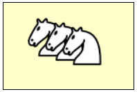

#### HTML ファイル抜粋

~~~ html
<body>
  <canvas id="myCanvas" width="150" height="100"></canvas>
  
</body>
~~~

このサンプルでは、画像ファイル `white_knight.png` を `canvas` 要素の上に描画しています。
Context オブジェクトの `drawImage()` メソッドは、画像ファイルをロードし終わった後に呼び出す必要があるため、Image オブジェクトの `onload` イベントハンドラで描画を行っています。

#### main.js

~~~ js
window.onload = function() {
    // Get a canvas context.
    var canvas = document.getElementById('myCanvas');  // HTMLCanvasElement
    var ctx = canvas.getContext('2d');  // CanvasRenderingContext2D

    // Draw a image.
    var img = new Image();
    img.onload = function() {
        ctx.drawImage(img, 20, 10);  // Draw the image at (20, 10).
        ctx.drawImage(img, 40, 15);  // Draw the image at (40, 15).
        ctx.drawImage(img, 60, 20);  // Draw the image at (60, 20).
    };
    img.src = './white_knight.png';
};
~~~

