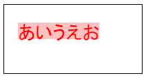

HTML5 Canvas に描画したテキストのサイズは、`CanvasRenderingContext2D.measureText()` を使用して調べることができます。
`measureText()` の戻り値は `TextMetrics` オブジェクトになっており、実際の描画領域のサイズを取得することができます。

- [CanvasRenderingContext2D.measureText() - Web APIs｜MDN](https://developer.mozilla.org/en-US/docs/Web/API/CanvasRenderingContext2D/measureText)
- [TextMetrics - Web APIs｜MDN](https://developer.mozilla.org/en-US/docs/Web/API/TextMetrics)

得られた `TextMetrics` オブジェクトの `width` プロパティを参照することで、実際の描画幅 (px) を調べることができます。
下記の例では、テキスト「あいうえお」を実際に描画した時の横幅を調べて、その幅で矩形を表示しています。

#### 実行結果

#### sample.html

~~~ html
<canvas id="my-canvas" width="200" height="100"></canvas>

~~~

