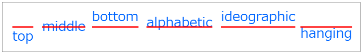

構文
----

~~~
void ctx.fillText(text, x, y [, maxWidth]);
void ctx.strokeText(text, x, y [, maxWidth]);
~~~

通常のテキスト描画を行うときは、CanvasRenderingContext2D オブジェクトの [fillText メソッド](https://developer.mozilla.org/ja/docs/Web/API/CanvasRenderingContext2D/fillText) を使用し、テキストの輪郭のみを描画するときは [strokeText メソッド](https://developer.mozilla.org/ja/docs/Web/API/CanvasRenderingContext2D/strokeText) を使用します。

どちらも、第1引数に描画するテキスト、第2引数にx座標、第3引数にy座標を指定します。
第4引数に関しては後述します。

~~~ javascript
ctx.fillText('Hello World', 20, 50);
ctx.strokeText('Hello World', 20, 50);
~~~

フォントの指定
----

fillText メソッドや strokeText メソッドでテキストを描画するときに使用するフォントは、CanvasRenderingContext2D オブジェクトの **font** プロパティで設定します。

~~~ javascript
ctx.font = '20pt Arial';
~~~

設定する値のフォーマットは、CSS の font プロパティと同様で、下記のような感じで設定することができます。

~~~
ctx.font = '48pt sans-serif';
ctx.font = 'bold 18px Times Roman';
ctx.font = 'italic 12pt monospaced';
ctx.font = 'bolder smaller serif';
~~~

fillStyle によるテキスト描画
----

{: .center }

fillStyle メソッドでテキストを描画するときは、**fillStyle** プロパティに設定した色でテキストのグリフが塗りつぶされるように描画されます（つまりごく普通のテキスト描画）。

~~~ html
<canvas id="canvas" width="250" height="100" style="border:solid gray 1px;"></canvas>

~~~

strokeStyle によるテキスト描画（輪郭）
----

{: .center }

strokeStyle メソッドでテキストを描画すると、テキストの輪郭だけが描画されます。
輪郭線の色は **strokeStyle** プロパティ、輪郭線の太さは **lineWidth** プロパティで指定することができます。

~~~ html
<canvas id="canvas" width="250" height="100" style="border:solid gray 1px;"></canvas>

~~~

第4引数で最大描画幅を指定する
----

fillText メソッドと、strokeText メソッドには、オプショナルの第4引数 (maxWidth) が用意されています。
第4引数でサイズ指定を行うと、その幅に収まるようにテキストが縮小されて描画されます。
縮小しなくてもテキストがそのサイズに収まる場合は縮小されず、font プロパティに指定したフォントサイズ通りに描画されます。

~~~ javascript
ctx.fillStyle = '#0f0';
ctx.font = 'bold 60pt sans-serif';
ctx.fillText('描画', 20, 80, 100);  // 最大描画幅を 100 ピクセルに指定
~~~

### 表示例

{: .center }

上側の画像は第4引数を指定せずに fillText を呼び出した場合、下側の画像は第4引数に 100 を指定して fillText を呼び出した場合の結果です。
100px 内に収まるように縮小されて描画されていることが分かります。

テキストアラインメントとベースラインの指定
----

CanvasRenderingContext2D オブジェクトの **textAlign** プロパティでアラインメント指定（横方向のアライン）、**textBaseline** プロパティでベースライン指定（縦方向のアライン）を指定することができます。

### 横方向のアラインメント (textAlign)

{: .center }

上記の描画例は、textAlign プロパティの値を変えた時に、fillText で指定した x 座標（赤ドット）とどのような位置関係で描画されるかを示しています（使用した HTML/JS コードは[こちら](text4.html.txt)）。

textAlign プロパティには以下のような値を設定できます。

- **start** (default): LTR (light-to-right) な言語では左寄せで表示され、RTL (right-to-left) な言語では右寄せで表示されます。canvas タグの `dir` 属性に `rtl` を指定すると、RTL 言語だとみなされます。
- **end**: start を指定した場合と反対で、LTR (light-to-right) な言語では右寄せで表示され、RTL (right-to-left) な言語では左寄せで表示されます。
- **left**: 左寄せで表示されます。
- **right**: 右寄せで表示されます。
- **center**: 中央寄せで表示されます。

### 縦方向のアラインメント (textBaseline)

{: .center }

下記の描画例は、textBaseline プロパティの値を変えた時に、fillText で指定した y 座標（赤ライン）とどのような位置関係で描画されるかを示しています（使用した HTML/JS コードは[こちら](text5.html.txt)）。

textBaseline プロパティには以下のような値を設定できます。

- **top**: y座標値がテキストの上端になります。
- **middle**: y座標値がテキストの中央になります。
- **bottom**: y座標値がテキストの下端になります。
- **alphabetic** (default): ラテン系言語（英語）で使われるベースラインです。
- **ideographic**: 日本語や中国語で使われるベースラインです。
- **hanging**: インドで使われる言語（Devangariなど）で使われるベースラインです。

テキストの描画サイズを調べる
----

HTML5 Canvas に描画したテキストのサイズは、[CanvasRenderingContext2D.measureText()](https://developer.mozilla.org/en-US/docs/Web/API/CanvasRenderingContext2D/measureText) を使用して調べることができます。
`measureText()` の戻り値は [TextMetrics オブジェクト](https://developer.mozilla.org/en-US/docs/Web/API/TextMetrics)になっており、実際の描画領域のサイズを取得することができます。

得られた `TextMetrics` オブジェクトの `width` プロパティを参照することで、実際の描画幅 (px) を調べることができます。

~~~ javascript
var width = ctx.measureText('text').width;
~~~

下記の例では、テキスト「あいうえお」を実際に描画した時の横幅を調べて、その幅で矩形を表示しています。

#### 実行結果

{: .center }

#### sample.html

~~~ html
<canvas id="canvas" width="200" height="100"></canvas>

~~~

