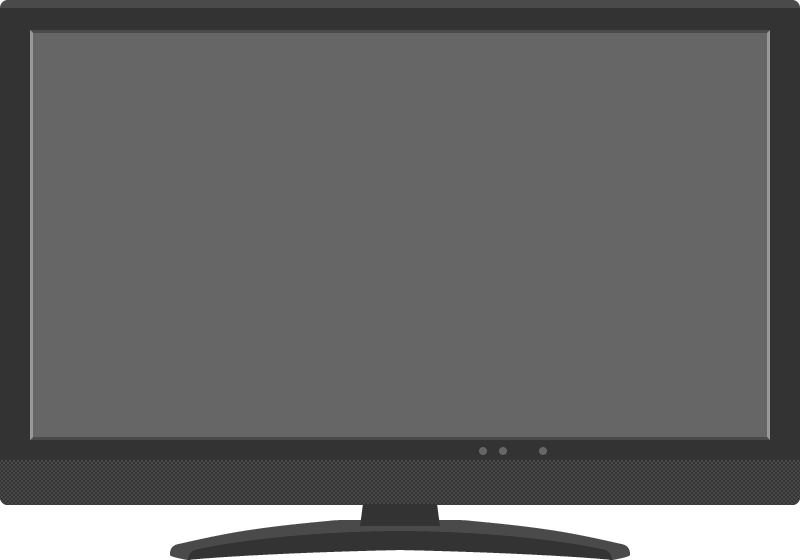

ここでは、次のようなテレビ画像のディスプレイ領域に、canvas 要素で描画するようにしてみます。

#### tv-frame.png

座標を合わせる
----

ここでは、テレビ画像と canvas 要素を重ねて表示するため、次のように外側のコンテナ要素 (div) を作成し、その中にそれぞれの要素をまとめて入れる構造にします。
canvas 要素の描画バッファサイズは、実際のテレビ画像のディスプレイ部分のサイズを調べ、それと合わせた値を設定 (365x200) しています。

~~~ html

  
  <canvas id="canvas" width="365" height="200"></canvas>

~~~

スタイルシートでは、position プロパティの指定により、img 要素と、canvas 要素をうまく位置をあわせて表示するように調整します。
テレビ画像ファイルのディスプレイ部分の左上座標は (17, 17) なので、canvas 要素の表示位置も (17, 17) に設定しています。

~~~ css
#container {
  position: relative;
}
#tv {
  all: initial; /* レスポンシブ対応を無効化 */
  position: absolute;
  top: 0px;
  left: 0px;
}
#canvas {
  position: absolute;
  top: 17px;
  left: 17px;
}
~~~

完成版デモ
----

  
  <canvas id="canvas" width="365" height="200"></canvas>

ちなみに、canvas に描画を行う JavaScript コードは次のようになっています。

~~~ javascript
window.onload = function () {
  var INTERVAL = 30; // ms
  var canvas = document.getElementById('canvas');
  var ctx = canvas.getContext('2d');

  function drawFrame() {
    // 半径 20px の円を中央に描く
    var x = Math.random() * canvas.width;
    var y = Math.random() * canvas.height;
    ctx.fillStyle = randomColor();  // 塗りつぶしの色
    ctx.fillRect(x, y, 50, 50);
  }

  function randomColor() {
      return '#' + Math.floor(Math.random() * 0xFFFFFF).toString(16);
  }

  function start() {
    setTimeout(function() {
      drawFrame();
      start();
    }, INTERVAL);
  }

  start();
}
~~~

ここでは、画像サイズや canvas 要素の表示サイズを固定にしていますが、画像の表示サイズを可変（レスポンシブ）にしていると、非常に難しい処理が必要になります。
なぜなら、現在の canvas 要素の仕様では、canvas の表示サイズをレスポンシブ対応することが難しく、上記のような表示位置のオフセット調整などがやりにくいからです。
W3C の活動によって canvas のレスポンシブ対応が進んでいくとよいですね。

