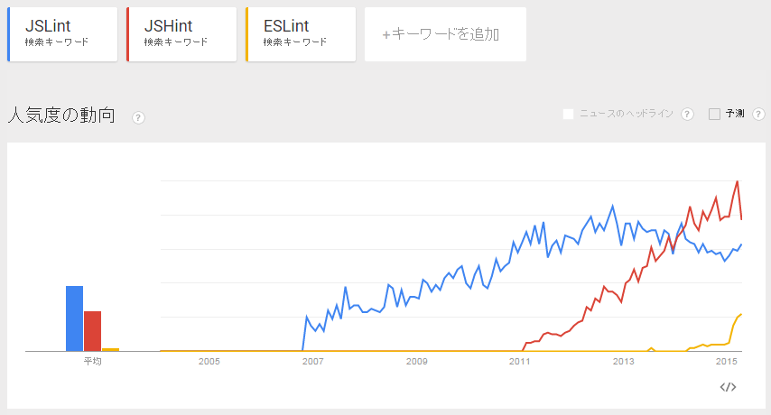

各ツールのトレンド
----

2015 年現在は **JSHint** が一番メジャーですが、これからは **ESLint** がよさげです。
**JSLint** は使われなくなりつつあります。

それぞれのツールの特徴
----

### JSLint ([http://jslint.com/](http://jslint.com/))

初期リリースは 2007 年頃。
作者は Douglas Crockford で、著書に JavaScript Good Parts があり、JSON RFC4627 の仕様策定などを行っている人です。
後出の **JSHint** に比べると、デフォルトのチェックが厳しいです。
この厳しさは好き嫌いが分かれるところで、逆にチェックの緩い **JSHint** の方が好まれる理由にもなっています。

### JSHint ([http://jshint.com/](http://jshint.com/))

初期リリースは 2011 年頃。
作者は Anton Kovalyov（アントン・コバリャノフ）で、**JSLint** の fork として作られました。
ベースとなった **JSLint** は便利である一方で、作者 Douglas Crockford の頑固な設定（`var` 宣言は 1 つにまとめないと必ずエラーなど）が強制されるため、開発者から敬遠される部分が多くありました。
そこで、Anton は、より柔軟な設定を行える **JSLint** となることを目指して 2011 年に **JSHint** の開発を始めました。

**JSLint** と比べると、デフォルト設定におけるチェックが甘いため、有効活用するためには適切な設定を行う必要があります。
設定は JSON 形式のファイル (`.jshintrc`) で行えます。
**JSHint** は、インデントのスペース数などのコーディングスタイルに関するチェックを行うことは対象外とすることを決め、そういったチェックは **JSCS** を使ってくださいということになりました（そこまでやるのなら **ESLint** を使った方が楽かも）。

### ESLint ([http://eslint.org/](http://eslint.org/))

初期リリースは 2013 年頃。
作者は Nicholas C. Zakas です。
ルールの拡張を自由に行えることが特徴で、これを Pluggable と読んでいます。
**JSLint**/**JSHint** 互換のルールも、デフォルトで Pluggable なルールとして用意されています。
実装的には、Esprima でパースした結果の AST (Abstract Syntax Tree) をそれぞれの Lint ルールに渡すようになっているため、**ESLint** の本体はクリーンな実装がキープされるようになっています（1-pass で実行されないため若干遅いところが欠点）。
それぞれのルールはルール名で区別され、個別に ON/OFF することができます（0:無効、1:警告として検出、2:エラーとして検出）。

**JSLint** や **JSHint** よりも、ドキュメントがしっかりと書かれていて好感が持てます。
**JSHint** よりも設定を分かりやすく柔軟に記述することができます。
設定ファイルは JSON あるいは Yaml 形式の `.eslintrc` で記述します。
Node.js アプリでは、`package.json` 内の `eslintConfig` フィールドに設定を書くことができます（こちらはもちろん JSON 形式で記述します）。
出力結果もデフォルトで色付けされていたり、エラーメッセージとともにルール ID などが表示されるので、細かいところに手が届いている感じがします。

どのようなコードを検出してくれるか？
----

ここでは、参考までに、JSLint と JSHint がどのようなコードに対して、どういった警告表示を行ってくれるかを示します。

### JSLint と JSHint 共通の検出項目（デフォルト設定時）

* 関数外で 'use strict' しているときに警告
  * JSLint: `Use the function form of 'use strict'.`
  * JSHint: `Use the function form of "use strict".`
* 未定義の変数、関数アクセスの警告
  * JSLint: `'xxx' was used before it was defined.`
  * JSHint: `'xxx' is not defined.`
* 未使用の変数、関数の検出
  * JSLint: `Unused 'xxx'.`
  * JSHint: `unused variable 'xxx'.`
* eval は使用禁止
  * JSLint: `eval is evil.`
  * JSHint: `eval can be harmful.`
* 行末にセミコロンがない
  * JSLint: `Expected ';' and instead saw 'xxx'.`
  * JSHint: `Missing semicolon.`
* case が break や return、throw で終わっていない
  * JSLint: `Missing 'break' after 'case'.`
  * JSHint: `Expected a 'break' statement before 'case'.`
* コンストラクタ（new をつけて呼んだ関数）が大文字で始まっていない
  * JSLint: `A constructor name 'xxx' should start with an uppercase letter.`
  * JSHint: `A constructor name should start with an uppercase letter.`
* new Object() の代わりに {} を使う
  * JSLint: `Use the object literal notation {} or Object.create(null).`
  * JSHint: `The object literal notation {} is preferable.`

### JSLint 独自の検出項目（デフォルト設定時）

* 'use strict'; がない場合に警告
  * `Missing 'use strict' statement.`
* 比較は == や != を使用せずに、=== や !== で行う
  * `Expected '===' and instead saw '=='.`
* おかしな条件の検出（switch (1) など）
  * `Weired condition.`
* ++ によるインクリメント、-- によるデクリメントはデフォルトで禁止
  * `Unexpected '++'.`
* インデントのスペース数
  * `Expected 'var' at column 3, not column 5.`
* 無名関数の function と () の間にスペースがないことを検出
  * `Expected exactly one space between 'function' and '('.`
* 一行の最大文字数
  * `Line too long.`
* if や for ステートメントは、必ず {} ブロックで囲む
  * `Expected '{' and instead saw 'xxx'.`
* 変数定義は関数の先頭でまとめて 1 つの var で行う
  * `Move 'var' declarations to the top of the function.`
  * `Don't declare variables in a loop.`
  * `Combine this with the previous 'var' statement.`

### JSHint 独自の検出項目（デフォルト設定時）

JSHint はデフォルトではほとんどチェックしてくれません。

* 変数と 0 の比較は '===' で行う
  * `Use '===' to compare with '0'.`

使い方
----

それぞれのツールの使い方は下記を参照してください。

- [JSLint で JavaScript コードの静的解析を行う](jslint.html)
- [JSHint で JavaScript コードの静的解析を行う](jshint.html)
- [ESLint で JavaScript コードの静的解析を行う](eslint.html)

