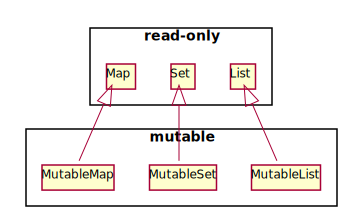

Kotlin で immutable なリストを生成するときは `listOf`、mutable なリストを生成するときは `mutableListOf` を使って生成していると思います。
ここでは、Kotlin がどのように immutable なリスト、mutable なリストを使い分けているかを説明します。
内部的な仕組みを知らなくてもあまり困ることはありませんが、全体像を把握しておくことで自信を持ってコレクション系の API を扱えるようになると思います。


Collection と MutableCollection
----

Kotlin のコレクション系オブジェクト（`List`、`Set`、`Map` オブジェクトなど）にアクセスするときは、リードオンリーでアクセスするのか、編集用にアクセスするのかによってインタフェースが使い分けられます。
要素を参照するだけであれば、**`Collection`** インタフェースを使用し、要素の追加や削除が必要な場合は **`MutableCollection`** インタフェースを使用します。

* [kotlin.collections.Collection インタフェース](https://kotlinlang.org/api/latest/jvm/stdlib/kotlin.collections/-collection/index.html)
    * `size`、`iterator`、`contains` など、要素を参照するためのインタフェースのみを備える。
* [kotlin.collections.MutableCollection インタフェース](https://kotlinlang.org/api/latest/jvm/stdlib/kotlin.collections/-mutable-collection/index.html)
    * `Collection` インタフェースを継承したインタフェース。
    * `add`、`remove`、`clear` など、要素を追加・削除するためのインタフェースを備える。

下記の `addAll` 関数は、2 つのコレクションをパラメータで受け取りますが、1 つ目のパラメータ `src` は参照用 (immutable) に使用され、2 つ目のパラメータ `dst` は内部で変更される (mutable) ことを示しています。

```kotlin
/**
 * [src] のすべての要素を [dst] の末尾に追加します。
 */
fun <T> addAll(src: Collection<T>, dst: MutableCollection<T>) {
    for (e in src) {
        dst.add(e)
    }
}

fun main() {
    val src: List<Int> = listOf(100, 200, 300)  // リードオンリー
    val dst: MutableList<Int> = mutableListOf(400, 500, 600)  // 編集可能
    addAll(src, dst)
    println(src)  //=> [100, 200, 300]
    println(dst)  //=> [400, 500, 600, 100, 200, 300]
}
```

リードオンリーな `Collection` オブジェクトを `MutableCollection` として渡そうとすると、Type mismatch のビルドエラーになります。

```kotlin
val src: List<Int> = listOf(100, 200, 300)
val dst: List<Int> = listOf(400, 500, 600)

// 下記はエラーになる
// Type mismatch: inferred type is List<Int> but MutableCollection<Int> was expected
addAll(src, dst)
```


3 大コレクション (List、Set、Map) の全体像
----

<a href="./immutable-and-mutable.puml.txt">
{: .center }
</a>

Kotlin では、`List` や `Set`、`Map` などの基本的なコレクションインタフェースはリードオンリーなインタフェースとして定義されており、それぞれ編集可能なインタフェースとして `MutableList`、`MutableMap`、`MutableSet` インタフェースを用意しています。

### コレクションオブジェクト生成のための関数

これらのコレクションオブジェクトを生成するための、`xxxOf()` という形のユーティリティ関数が用意されており、およそ下記のような継承関係になっています。
多くの場合は、ハイライトされている、基本の 6 種類のオブジェクトを生成する関数で事足りるでしょう。

- <b>List (read-only)</b>: **`listOf()`**
    - <b>MutableList (mutable)</b>: **`mutableListOf()`**
        - ArrayList (mutable): `arrayListOf()`
- <b>Set (read-only)</b>: **`setOf()`**
    - <b>MutableSet (mutable)</b>: **`mutableSetof()`**
        - HashSet (mutable): `hashSetOf()`
        - LinkedHashSet (mutable): `linkedSetOf()`
    - java.util.SortedSet (mutable): `sortedSetOf()`
- <b>Map (read-only)</b>: **`mapOf()`**
    - <b>MutableMap (mutable)</b>: **`mutableMapOf()`**
        - HashMap (mutable): `hashMapOf()`
        - LinkedHashMap (mutable): `linkedMapOf()`
    - java.util.SortedMap (mutable): `sortedMapOf()`

注意しなければいけないのは、`listOf()` や `setOf()` によって実際に生成されるオブジェクトは、従来の Java 実装によるコレクションインスタンスかもしれないということです。
つまり、read-only なのはあくまでインタフェースだけであり、その背後で操作しているオブジェクトは mutable（可変）かもしれないということです。


### Java の java.util.Collection との互換性

Java の `java.util.Collection` オブジェクトをパラメータに取るメソッドには、Kotlin の `Collection` および `MutableCollection` オブジェクトのいずれも渡すことができます。
Kotlin の `Collection` インタフェースは read-only を示すインタフェースですが、要素を変更可能な Java の `java.util.Collection` オブジェクトとして渡せてしまいます。
これは、Kotlin の `Collection` オブジェクトが、実質的には immutable（不変）ではないということを示しています。

```kotlin
val list: List<Int> = listOf(1, 2, 3, 4, 5)  // immutable な List を作成しているつもり
java.util.Collections.reverse(list)  // mutable な java.util.List として渡せてしまう
println(list)  //=> [5, 4, 3, 2, 1]
```

ちなみに、上記のように配列やコレクションの要素を逆順にしたい場合は Kotlin の `reverse` 関数を使いましょう。
Kotlin では下記のように書くのが正解です。

```kotlin
val list: MutableList<Int> = mutableListOf(1, 2, 3, 4, 5)
list.reverse()
println(list)  //=> [5, 4, 3, 2, 1]
```

この場合は、もちろん mutable な `MutableList` に対してしか実行できないようになっています。

