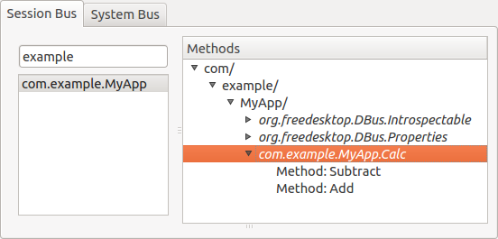

下記は dbus-glib によるサーバ実装のファイル一式です。

- [dbus-glib-server.zip](./dbus-glib-server.zip)

実行してから `qdbusviewer` アプリの表示を見ると、セッションバスに登録された `com.example.MyApp` サービスを確認することができます。

ちゃんと、`com.example.MyApp.Calc` インタフェースが公開されていることが分かります。

