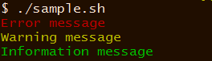

次のようにすると、`echo` コマンドでテキストを出力するときの色を変更できます。

#### sample.sh

~~~ bash
#!/bin/bash

error() {
    echo -e "\033[31m$*\033[00m"
}

warn() {
    echo -e "\033[33m$*\033[00m"
}

info() {
    echo -e "\033[32m$*\033[00m"
}

error 'Error message'
warn 'Warning message'
info 'Information message'
~~~

#### 実行結果

