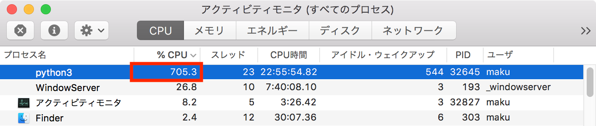
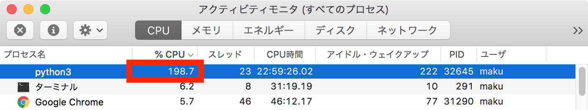

概要
----

普段使い用の PC 上でディープラーニングのプログラムを走らせたりすると、CPU の負荷が 100% になってしまい、別の作業に支障が出てしまうことがあります（特に計算処理に GPU を使えない環境の場合）。
CPU の発熱量が半端なく、ファンが全力で回転してうるさくて集中できなくなってしまいます。
長時間高温な状態で動作させると、ハードウェアへのダメージも大きくなってしまうでしょう。

CPU 負荷を下げようとして、`nice` コマンドや `renice` コマンドを使用してプロセスの優先度（nice 値）の値を変更しても無駄です。
なぜなら、プロセスの優先度設定は、あくまで別のプロセスと比較したときの CPU 使用率の割合を変更するものであり、システムをアイドル状態にすることを促すものではないからです。
優先度の低いプロセスであっても、CPU に空きがあったら 100% まで使用してしまいます。

このようなときは、**cpulimit** を使ってプロセスの CPU 使用率を制限してやることで、負荷の低い状態をキープすることができます。
もちろん、そのプロセス内の処理には時間がかかるようになってしまいますが、ゆっくりでいいから処理が進めばいい、といったケースでは重宝すると思います。

cpulimit のインストール方法
----

cpulimit はそれぞれの OS 用のパッケージを使ってインストールしてしまうのが手っ取り早いでしょう。

#### Mac の場合（Homebrew を使用）

~~~
$ brew install cpulimit
~~~

#### Ubuntu (Linux) の場合

~~~
$ sudo apt-get install cpulimit
~~~

cpulimit の使い方
----

cpulimit の `-l (--limit)` オプションを使用して、特定のプロセスの CPU 使用率をパーセンテージ指定で制限することができます。

### 例: プロセス番号 12345 を CPU 使用率50％に制限

~~~
$ cpulimit -l 50 -p 12345
~~~

`ps` コマンドなどで実行中のプロセスのプロセス ID を確認することができれば、その ID を指定して CPU 使用率に制限をかけることができます。
上記のように CPU 使用率を制限した場合、cpulimit のプロセスの方を `Ctrl-C` で停止すれば制限が解除されます。

### 例: CPU 使用率を指定して任意のコマンドを起動

~~~
$ cpulimit -l 50 ＜コマンド＞
~~~

上記のように実行すると、最初から CPU 使用率に制限をかけた状態で任意のコマンドを起動することができます。

マルチコア CPU の場合の CPU 使用率
----

マルチコア CPU の環境を使用している場合、`-l (--limit)` オプションで指定可能なパーセンテージは、100 を超えます。
例えば、8 コアの CPU の場合、`-l (--limit)` オプションで指定できる値は 0〜800 になります。
現在の環境でどの範囲の値を指定することができるかは、下記のように `cpulimit` コマンドのヘルプの表示で確認することができます。

~~~
$ cpulimit -h | grep percentage
      -l, --limit=N          percentage of cpu allowed from 0 to 800 (required)
~~~

例えば、下記の画面は Mac のアクティビティモニタ上で CPU の使用率を表示したものですが、先頭に表示されている Python プログラムは 8 コアの CPU すべてを使い、700% 前後の使用率で動作しています。

<figure>
  
  <figcaption>700% 近くの CPU 使用率</figcaption>
</figure>

次のように実行すれば、このプロセスの CPU 使用率を 200% に制限できます。

~~~
$ cpulimit -p 32645 -l 200
Process 32645 found
~~~

しばらくすると、アクティビティモニタ上の CPU 使用率も 200% 程度に下がっていることを確認できます。

<figure>
  
  <figcaption>CPU 使用率が 200% に制限された</figcaption>
</figure>

cpulimit は内部で何をやっているか？
----

下記は [cpulimit の GitHub サイト](https://github.com/opsengine/cpulimit)からの抜粋です。

> The control of the used CPU amount is done sending SIGSTOP and SIGCONT POSIX signals to processes. All the children processes and threads of the specified process will share the same percentage of CPU.

指定したプロセスの CPU 使用率が `-l (--limit)` オプションによる制限を超えた場合、`SIGSTOP` シグナルを送ってプロセスを一時停止、その後 `SIGCONT` シグナルで処理を再開、ということを行って CPU の使用率が上がらないように制御しているようです。

