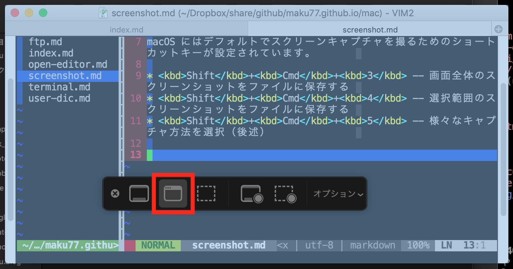

スクリーンショットを撮るためのショットカット
----

macOS にはデフォルトでスクリーンキャプチャを撮るためのショートカットキーが設定されています。

* <kbd>Shift</kbd>+<kbd>Cmd</kbd>+<kbd>3</kbd> -- 画面全体のスクリーンショットをファイルに保存する
* <kbd>Shift</kbd>+<kbd>Cmd</kbd>+<kbd>4</kbd> -- 選択範囲のスクリーンショットをファイルに保存する
* <kbd>Shift</kbd>+<kbd>Cmd</kbd>+<kbd>5</kbd> -- 様々なキャプチャ方法を選択（後述）

選択したウィンドウのキャプチャ、画面の動画を撮る
----

<kbd>Shift</kbd>+<kbd>Cmd</kbd>+<kbd>5</kbd> というショートカットキーを使用すると、下記のようなキャプチャのためのダイアログが表示されます。
例えば、左から 2 番目のアイコンを選択（下記の赤枠のアイコン）すると、マウスカーソルがカメラの形に変わり、選択したウィンドウのキャプチャを撮ることができます。

{: .center }

さらに、右端には <samp>画面全体を収録</samp> と <samp>選択部分を収録</samp> のボタンがあり、これを使って PC 画面の動画撮影を行うことができます。
<samp>オプション</samp> ボタンを押すと、動画の撮影時間や、マウスカーソルの表示、クリックの表示などを設定することができます。

影なしでキャプチャする
----

ウィンドウのキャプチャは、デフォルトでは影のついたものになります。
影を付けないようにするには、<kbd>Option</kbd> キーを押した状態でキャプチャを実行します（カメラアイコンが表示されているときに押します）。

