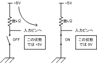

### 発振モード

<TABLE align="center">
	<TR>
		<TH>MODE</TH><TH>BIT</TH><TH>DESCRIPTION</TH><TH>FREQ RANGE</TH>
	</TR>
	<TR>
		<TD class="namec">LP</TD><TD class="c">00</TD>
		<TD>低電力／水晶発振 (Low Power Crystal)</TD>
		<TD>200kHz 以下</TD>
	</TR>
	<TR>
		<TD class="namec">XT</TD><TD class="c">01</TD>
		<TD>水晶／セラミック発振 (Crystal／Resonator)</TD>
		<TD>4MHz 以下</TD>
	</TR>
	<TR>
		<TD class="namec">HS</TD><TD class="c">10</TD>
		<TD>高周波水晶／セラミック発振 (High Speed Crystal／Resonator)</TD>
		<TD class="strong">4MHz ～ 20MHz</TD>
	</TR>
	<TR>
		<TD class="namec">RC</TD><TD class="c">11</TD>
		<TD>RC 発振 (Resister／Capacitor)</TD>
		<TD>1MHz 以下</TD>
	</TR>
</TABLE>

### リセット回路

**MCLR** に電源をつないでおけば、とりあえずは動作しますが、周辺回路の電源が安定するまで遅延して 4.5V の入力があるべきです。
リセット用の IC にはミツミの PST600C などがあります。

### MAX232

- MAX232 ･･･ 1μF のコンデンサを使う
- MAX232A ･･･ 0.1μF
- ADM232AAN ･･･ 0.1μF

### 命令長の違う 3 シリーズ

- ベースライン・シリーズ ･･･ 12ビット命令 (12C5xx, 16C5xx)
- ミッドレンジ・シリーズ ･･･ 14ビット命令
- ハイエンド・シリーズ ･･･ 16ビット命令 (17Cxxx, 18Cxxx)

一番使われている PIC16Fxxx などはミッドレンジ・シリーズにあたります。

### AC と DC

- AC --- Alternating Current (交流)
- DC --- Direct Current (直流)

### VIH, VIL, VOH, VOL

- VIH = 3.15V MIN ･･･ これ以上の入力電圧を High 入力とみなす
- VIL = 1.35V MAX ･･･ これ以下の入力電圧を Low 入力とみなす
- VOH = 4.4V MIN ･･･ High 出力の時これ以上の電圧を出力する
- VOL = 0.1V MAX ･･･ Low 出力の時これ以下の電圧を出力する

入力電圧が High か Low かを決める閾値は VIL ～ VIH の値になります。
シュミットトリガ・インバータ (74HC14) などは、立ち上がり (Low → High と判断する時 (THH)) と、立ち下り (High → Low と判断する時 (THL)) でこの閾値が異なります。
この閾値の差を**ヒステリシス**と呼びます。

ヒステリシスを持たない 74HC04 よりも 74HC14 の方が入力電圧の微妙なぶれ（ノイズ）に強いといえます。
なぜなら、THH は THL よりも高い値に設定されていて、立ち上がりの際に入力電圧が少し下がっても THL まで下がることは少ないからです。

### スイッチ入力回路の基本

{: .center}

通常はスイッチが OFF の時に入力ピンに High が入るようにします。
上の図は概念図であり、実際にはチャタリングを防止する回路などが必要になります。

### PIC16F84 と PIC16F84A

<TABLE align="center">
	<TR>
		<TH>&nbsp;</TH><TH>PIC16F84</TH><TH>PIC16F84<b>A</b></TH>
	</TR>
		<TD class="namec">最大クロック周波数</TD>
		<TD>DC 10MHz</TD>
		<TD>DC 20MHz</TD>
	</TR>
	<TR>
		<TD class="namec">動作電圧範囲</TD>
		<TD>2.0V ～ 6.0V (1.5V 乾電池 x 4 できる)</TD>
		<TD>2.0V ～ 5.5V</TD>
	</TR>
</TABLE>

PIC のシンク／ソース電流の最大値は各 I/O ピンごとに 25mA, PORTA や PORTB の合計が 200mA 以下というように決まっています。
詳しくはデータシートを参照してください（キーワード：電気的特性、絶対最大定格）。

