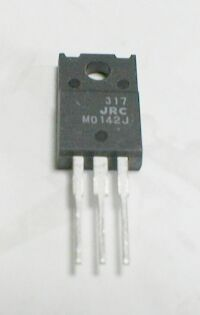
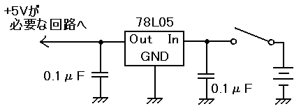

### 可変３端子レギュレータ LM317

{: .center}

- 大きめの四角いレギュレータ **7805 (DC, +5V 1A)** は、出力電流が 1A あり、7～20V を 5±0.25V に変換できます。
- ちっちゃい３端子レギュレータ **78L05 (DC, +5V 100mA)** は、ひらぺったい方から見て、右の端子から IN, GND, OUT になっています。**この順番はレギュレータごとに異なる**ので、必ずデータシートで確認する必要があります。7～25V を 5±0.25V に変換できます。

### ３端子レギュレータの配線

{: .center}

３端子レギュレータの入力、出力側に共通のグランドが必要です。
出力側のコンデンサは不要ですが、あると過渡応答を改善できます。

