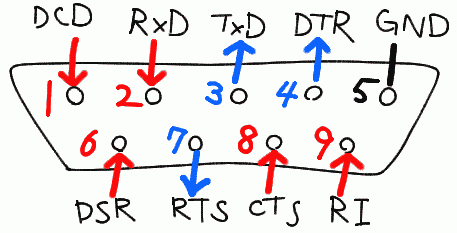

はじめに（用語とか）
----

- **スペース状態** ･･･ 信号 0。入力 +3V 以上。出力 +5V ～ +15V。
- **マーク状態** ･･･ 信号 1。入力 -3V 以下。出力 -5V ～ -15V。
- **短絡時最大出力電流** ･･･ 500mA。
- **ハードウェアフローコントロール** ･･･ RTS と CTS の信号線を使ったフロー制御。RTS／CTS とも記述されます。
- **ソフトウェアフローコントロール** ･･･ ソフトウェアによるフロー制御。アプリケーションで決められた特殊な記号を送信することでフロー制御を行います。RTS と CTS ワイヤは使用しません。Xon／Xoff とも記述されます。
- **DTE デバイス** ･･･ 通常は PC を示します。オスコネクタを持ちます。
- **DCE デバイス** ･･･ 通常は シリアルデバイスを示します。メスコネクタを持ちます。DTE デバイスと DCE デバイスをつなぐ時は通常ストレートケーブルを用います。
- **ヌルモデムケーブル／ヌルアダプタ** ･･･ 送信と受信の信号線をクロスさせたものです。TxD ⇔ RxD、DTR ⇔ DSR、RTS ⇔ CTS のようにクロスされます。

DSub 9 ピン
----

{: .center}

（DTE デバイス（PC 側）オス）

<TABLE align="center">
	<CAPTION>9 ピンミニ DSUB コネクタ (PC 側オス)</CAPTION>
	<TR>
		<TH>ピン番号</TH><TH>表記</TH><TH>I/O</TH><TH>意味</TH><TH>説明</TH>
	</TR>
	<TR>
		<TD class="namec">1</TD>
		<TD class="namec2">DCD</TD>
		<TD class="c">In</TD>
		<TD>Data Carrier Detect（キャリア検出）</TD>
		<TD>外部端末の送受信準備ができたことを知る</TD>
	</TR>
	<TR>
		<TD class="namec">2</TD>
		<TD class="namec2">RxD</TD>
		<TD class="c">In</TD>
		<TD>Receive Data（受信データ）</TD>
		<TD>&nbsp;</TD>
	</TR>
	<TR>
		<TD class="namec">3</TD>
		<TD class="namec2">TxD</TD>
		<TD class="c">Out</TD>
		<TD>Transmit Data（送信データ）</TD>
		<TD>&nbsp;</TD>
	</TR>
	<TR>
		<TD class="namec">4</TD>
		<TD class="namec2">DTR</TD>
		<TD class="c">Out</TD>
		<TD>Data Terminal Ready（データ端末準備）</TD>
		<TD>PC が繋がっていることを認識させる（PC → 外部）</TD>
	</TR>
	<TR>
		<TD class="namec">5</TD>
		<TD class="namec2">GND</TD>
		<TD class="c">---</TD>
		<TD>Ground（信号用グラウンド）</TD>
		<TD>&nbsp;</TD>
	</TR>
	<TR>
		<TD class="namec">6</TD>
		<TD class="namec2">DSR</TD>
		<TD class="c">In</TD>
		<TD>Data Set Ready（データセット準備）</TD>
		<TD>端末が繋がっていることを認識する（PC ← 外部）</TD>
	</TR>
	<TR>
		<TD class="namec">7</TD>
		<TD class="namec2">RTS</TD>
		<TD class="c">Out</TD>
		<TD>Request To Send (DTE の送信要求)</TD>
		<TD>PC の送信開始信号（フロー制御用）（PC → 外部）</TD>
	</TR>
	<TR>
		<TD class="namec">8</TD>
		<TD class="namec2">CTS</TD>
		<TD class="c">In</TD>
		<TD>Clear To Send（DCE の送信要求）</TD>
		<TD>PC への受信開始要求（フロー制御用）（PC ← 外部）</TD>
	</TR>
	<TR>
		<TD class="namec">9</TD>
		<TD class="namec2">RI</TD>
		<TD class="c">In</TD>
		<TD>Ring Indication（被呼表示）</TD>
		<TD>電話がかかってきたことを伝える／PC の電源を制御する</TD>
	</TR>
</TABLE>

PC からデータを送信するのに最低限必要なのは、TxD(3) と GND(5) です。
データを受信する時は RxD(2) が必要です。
出力の信号線は、デフォルトでマーク状態(-)かスペース状態(+)のどちらかを出力してます。

<TABLE align="center">
	<TR>
		<TH>信号線</TH><TH>COMポート接続時</TH><TH>COMポートオープン時</TH>
	</TR>
	<TR>
		<TD class="namec">TxD (3)</TD><TD>mark(-)</TD><TD>mark(-)</TD>
	</TR>
	<TR>
		<TD class="namec">DTR (4)</TD><TD>mark(-)</TD><TD>space(+)</TD>
	</TR>
	<TR>
		<TD class="namec">RTS (7)</TD><TD>mark(-)</TD><TD>space(+)</TD>
	</TR>
</TABLE>

小さな回路なら、DTR(4) と RTS(7) から電源供給することができます。
といっても電流量は少ないし、マシンによって供給量が多少異なるので、あまり信頼できません。
DTR(4) と RTS(7) を並列に繋ぐと電流を増やせます。

- **CD／DCD (1)** ･･･ モデムが相手側のモデムと接続を確立した時や、キャリアトーンの検出を知らせます。この信号線はめったに使用されません。
- **RD／RxD (2)** ･･･ DCE から DTE へのデータ受信に使用されます。RD ワイヤは DTE デバイスがアイドル状態の時、マーク状態になります。
- **TD／TxD (3)** ･･･ DTE から DCE へのデータ送信に使用されます。TD ワイヤは DTE デバイスがアイドル状態の時、マーク状態になります。逆にバッファがいっぱいの時はスペース状態になります。
- **DTR (4)** ･･･ DTE デバイスの準備ができていることを示します。電源が入っていることを確かめるために使用したりしますが、あまり使われない信号線です。Windows で COM ポートを開くと 1 になり、閉じると 0 になります。
- **DSR (6)** ･･･ DCE デバイスの準備ができていることを示します。電源が入っていることを確かめるために使用したりしますが、あまり使われない信号線です。
- **RTS (7)** ･･･ DTE デバイスと DCE デバイス両方のハードウェアフローコントロールが ON の場合に使用されます。DTE がデータ受信可能（待機中）な時は、このワイヤがマーク状態になります。逆にバッファがいっぱいの時はスペース状態になります。
- **CTS (8)** ･･･ DTE デバイスと DCE デバイス両方のハードウェアフローコントロールが ON の場合に使用されます。DCE がデータ受信可能（待機中）な時は、このワイヤがマーク状態になります。
- **RI (9)** ･･･ モデムが呼び出し信号を受信したことを知らせます。つまり電話が鳴ったときに PC にそれを知らせます。この信号線はめったに使用されません。

非同期通信
----

Windows などの PC では主に非同期通信が使用されます。
同期通信のように常に信号をやりとりしていないため、データの送信を示すためのスタートビットが必要になります。
データを送信していない時（アイドル時）は TX はマーク状態 (1) になっているので、スタートビットは 0 の信号になります。
1 つのデータの構造は次のようになります。

<TABLE align="center">
	<TR>
		<TD class="c">スタートビット （1 bit）</TD>
		<TD class="c">データ （4 ～ 8 bits。主に 8 bits）</TD>
		<TD class="c">ストップビット （1 bit）</TD>
	</TR>
</TABLE>

ケーブル長
----

<TABLE align="center">
	<CAPTION>24 ゲージワイヤの実用的なケーブル長</CAPTION>
	<TR>
		<TH>Baud Rate</TH>
		<TH>シールドケーブル</TH><TH>非シールドケーブル</TH>
	</TR>
	<TR class="r">
		<TD class="namec">110</TD><TD>1500 m</TD><TD rowspan="2">300 m</TD>
	</TR>
	<TR class="r">
		<TD class="namec">300</TD><TD>1200 m</TD>
	</TR>
	<TR class="r">
		<TD class="namec">1200</TD><TD>900 m</TD><TD rowspan="2">150 m</TD>
	</TR>
	<TR class="r">
		<TD class="namec">2400</TD><TD>600 m</TD>
	</TR>
	<TR class="r">
		<TD class="namec">4800</TD><TD>150 m</TD><TD>75 m</TD>
	</TR>
	<TR class="r">
		<TD class="namec">9600</TD><TD>75 m</TD><TD>30 m</TD>
	</TR>
</TABLE>

