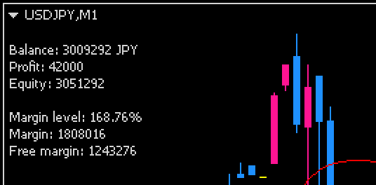

下記の AccountInfo インジケータを使用すると、チャート上に口座情報（証拠金情報）を表示することができます。

- [AccountInfo.mq4](https://github.com/maku77/metatrader/blob/master/Indicators/maku/AccountInfo.mq4)

それぞれの表示は下記のような意味を持っています。

- Balance: 証拠金残高
- Profit: 損益
- Equity: 純資産（証拠金残高 - 損益）
- Margin level: 証拠金維持率
- Margin: 必要証拠金
- Free margin: 有効証拠金

