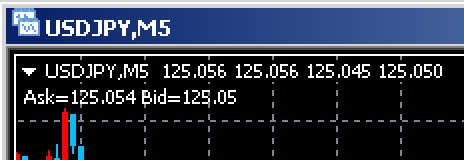
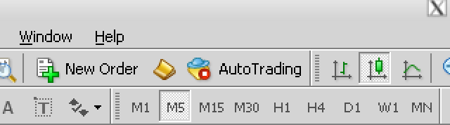
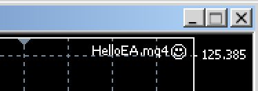

MetaTrader を使って自動売買を行うには、__EA (Expert Advisor)__ を作成する必要があります。
ここでは最初のステップとして、価格が変わる (Tick) ごとに、チャートの左上に Ask（買値）、Bid（売値）を表示する EA を作成してみます。　



Meta Editor 上で `Control + N` を押して、Expert Advisor を新規作成します。

#### HelloEA.mq4
```mql
void OnTick() {
    Comment("Ask=", Ask, " Bid=", Bid);
}
```

EA をあるチャートにセットすると、そのチャート上でティックごとに `OnTick()` が呼び出されます。
MQL4 では、その時点での価格を Ask、Bid というグローバル変数から取得することができます。

Expert Advisor の実行
====

作成した Expert Advisor をあるチャート上で実行するには、以下のようにします。

### 1) 任意のチャート上に EA をセットする

1. Navigator ビューの Expert Advisor から対象の EA をチャートにドラッグ＆ドロップ
2. ダイアログが表示されるので、__Allow live trading__ にチェックを入れて OK

### 2) Meta Trader の全体設定で Live Trading を有効にする

1. メニューから Tools => Options を選択
2. Expert Advisor のタブの __Allow automated trading__ にチェックを入れる
  （あるいはツールバー上の __AutoTrading__ ボタンを押して有効にできます）



これで、EA が動き始めます。
チャートの右上に EA 名とにっこりマークが表示されていれば、ちゃんと動作しています。


