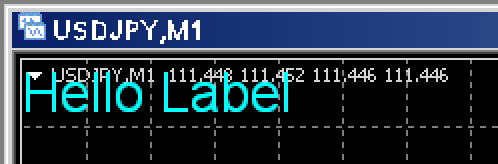

ラベルオブジェクトについて
----



ラベルオブジェクト (`OBJ_LABEL`) は、MetaTrader のチャート上に表示できる描画オブジェクトのひとつです。
ラベルオブジェクトの表示位置は、ウィンドウ上の左上を起点 (`CORNER_LEFT_UPPER`) として XY 座標が指定されるため、チャートを時間軸方向に移動させても、ラベルの表示位置は固定されて動きません（一方で、テキストオブジェクト (`OBJ_TEXT`) の場合は、表示位置が時間 (time) と価格 (price) で指定されるため、チャートの時間軸を移動させると同時に移動します）。


ラベルオブジェクトの作成
----

ラベルオブジェクトを作成するには、組み込み関数である [ObjectCreate](https://www.mql5.com/ja/docs/objects/objectcreate) の `type` パラメータに `OBJ_LABEL` を指定します。

```mql
bool ObjectCreate(
   long         chart_id,  // チャート識別子（0 はカレントチャート）
   string       name,      // オブジェクト名 (ラベルの識別子）
   ENUM_OBJECT  type,      // オブジェクトの型（OBJ_LABEL を指定）
   sub_window   nwin,      // ウィンドウインデックス（0 はメインウィンドウ）
   datetime     time1,     // 1 番目のアンカーポイントの時間（ラベルの場合は使用しない）
   double       price1,    // 1 番目のアンカーポイントの価格（ラベルの場合は使用しない）
)
```

ラベルオブジェクトは、チャート上に複数追加することができますが、これらのラベルは、チャート ID（`chart_id` パラメータ）と、オブジェクト名 (`name`) で識別することになります。
現在アクティブになっているチャートにラベルを追加するのであれば、`chart_id` は 0 に設定します。
オブジェクト名はチャートの中で一意になるような名前を付けます。
ラベルオブジェクトは、XY 座標指定で表示位置を指定するので、`time1` パラメータと `price1` パラメータは本来必要ないのですが、`ObjectCreate` 関数の仕様として、これらのパラメータが省略できないようになっているので、何らかの値を指定して呼び出す必要があります（イケてない・・・）。

例えば、カレントチャート (`chart_id=0`) の、メインウィンドウ (`nwin=1`) に表示するためのラベルオブジェクトを作成するには下記のようにします。

```
if (!::ObjectCreate(0, "Label1", OBJ_LABEL, 0, 0, 0)) {
    // ラベルオブジェクトの作成に失敗
}
```

すでに同じ名前 (`name`) のオブジェクトが、そのチャートに追加されている場合は、`ObjectCreate` は失敗します。

ラベルオブジェクトのプロパティ設定
----

ラベルオブジェクトに表示するテキストや、表示位置などを設定するには、`ObjectSetXxx` 系のメソッドを使用します。
どのラベルオブジェクトに対する設定なのかを示すために、第一引数と、第二引数で、それぞれチャート ID とラベル名を指定する必要があります。

```mql
// ラベルに表示するテキスト
::ObjectSetString(0, "Label1", OBJPROP_TEXT, "Hello");  // 表示テキスト
::ObjectSetString(0, "Label1", OBJPROP_FONT, "Arial");  // フォント
::ObjectSetInteger(0, "Label1", OBJPROP_FONTSIZE, 20);  // フォントサイズ

// ラベルの表示位置
::ObjectSetInteger(0, "Label1", OBJPROP_XDISTANCE, 0);  // X 座標
::ObjectSetInteger(0, "Label1", OBJPROP_YDISTANCE, 0);  // Y 座標
::ObjectSetInteger(0, "Label1", OBJPROP_CORNER, CORNER_LEFT_UPPER);  // 基準座標
::ObjectSetInteger(0, "Label1", OBJPROP_ANCHOR, ANCHOR_LEFT_UPPER);  // アンカー
```

ラベルオブジェクトの削除
----

プログラムによってラベルオブジェクトを追加したのであれば、プログラムからラベルを削除するにようしておくのが行儀のよいプログラムです。
例えば、インジケータの `OnInit` イベントハンドラでラベルを追加したのであれば、`OnDeinit` イベントハンドラでラベルを削除するのがよいでしょう。

```mql
int OnInit() {
    return AddLabel() ? INIT_SUCCEEDED : INIT_FAILED;
}

void OnDeinit(const int reason) {
    DeleteLabel();
}
```

サンプルコード
----

下記のサンプルコードは、画面左上にラベルを表示するだけの簡単なインジケータの例です。
インジケータをチャートにアタッチするとラベルが表示され、インジケータをデタッチするとラベルが削除されます。

#### Indicator/LabelSample.mq4

```mql
#property copyright "maku77"
#property link      "https://maku77.github.io/"
#property version   "1.00"
#property strict
#property indicator_chart_window

#include <stdlib.mqh>  // to use ErrorDescription

static const string LABEL_NAME = "Label1";  // ラベルの ID
static const string LABEL_TEXT = "Hello Label";  // 表示するテキスト

bool AddLabel() {
    const int chart = 0;             // 0 means the current chart
    const int subWindow = 0;         // 0 means the main window
    const string name = LABEL_NAME;  // Label ID to be added

    // ラベルの作成
    if (!::ObjectCreate(chart, name, OBJ_LABEL, subWindow, 0, 0)) {
        ::Alert("Failed to create a label: ", ErrorDescription(::GetLastError()));
        return false;
    }

    // ラベルに表示するテキスト
    ::ObjectSetString(chart, name, OBJPROP_TEXT, LABEL_TEXT);
    ::ObjectSetString(chart, name, OBJPROP_FONT, "Arial");
    ::ObjectSetInteger(chart, name, OBJPROP_FONTSIZE, 20);

    // ラベルの表示位置
    ::ObjectSetInteger(chart, name, OBJPROP_XDISTANCE, 0);
    ::ObjectSetInteger(chart, name, OBJPROP_YDISTANCE, 0);
    ::ObjectSetInteger(chart, name, OBJPROP_CORNER, CORNER_LEFT_UPPER);
    ::ObjectSetInteger(chart, name, OBJPROP_ANCHOR, ANCHOR_LEFT_UPPER);

    // ラベルの色
    ::ObjectSetInteger(chart, name, OBJPROP_COLOR, clrCyan);

    // ラベルをドラッグ＆ドロップできるか
    ::ObjectSetInteger(chart, name, OBJPROP_SELECTABLE, false);
    ::ObjectSetInteger(chart, name, OBJPROP_SELECTED, false);

    return true;
}

void DeleteLabel() {
    const int chart = 0;
    ::ObjectDelete(chart, LABEL_NAME);
}

//--- event handlers ---

int OnInit() {
    return AddLabel() ? INIT_SUCCEEDED : INIT_FAILED;
}

void OnDeinit(const int reason) {
    DeleteLabel();
}

int OnCalculate(const int rates_total, const int prev_calculated,
                const int begin, const double& price[]) {
    // Nothing to do
    return rates_total;
}
```


オブジェクト指向バージョン (CChartObjectLabel) を使用する方法
----

MQL5 で定義された `CChartObjectLabel` クラスは、オブジェクト指向なラベルオブジェクトを提供します。
`CChartObjectLabel` クラスは `CChartObject` クラスを継承して作成されており、`CChartObject` クラスのデストラクタでは、チャートから描画オブジェクトを削除するコードが記述されています。
つまり、このデストラクタをうまく利用することで、プログラムの終了時（例えばインジケータのデタッチ時）に自動的にラベルオブジェクトを削除することができます。

下記のインジケータのサンプルコードで、ラベルオブジェクトを明示的に削除していないことに注目してください。

```mql
#include <stdlib.mqh>  // ErrorDescription
#include <ChartObjects/ChartObjectsTxtControls.mqh>  // CChartObjectLabel

// ここではラベルオブジェクトをグローバルに定義（終了時の自動削除のため）
CChartObjectLabel gLabel;

bool AddLabel() {
    const int chart = 0;      // 0 means the current chart
    const int subWindow = 0;  // 0 means the main window

    // ラベルの作成
    if (!gLabel.Create(chart, "Label1", subWindow, 0, 0)) {
        Alert("Failed to create a label: ", ErrorDescription(GetLastError()));
        return false;
    }

    // ラベルに表示するテキスト
    gLabel.SetString(OBJPROP_TEXT, "Hello Label");
    gLabel.Font("Arial");
    gLabel.FontSize(20);

    // ラベルの表示位置
    gLabel.X_Distance(0);
    gLabel.Y_Distance(0);
    gLabel.Corner(CORNER_LEFT_UPPER);
    gLabel.Anchor(ANCHOR_LEFT_UPPER);

    // ラベルの色
    gLabel.Color(clrCyan);

    // ラベルをドラッグ＆ドロップできるか
    gLabel.Selectable(false);
    gLabel.Selected(false);

    return true;
}

//--- event handlers ---

int OnInit() {
    return AddLabel() ? INIT_SUCCEEDED : INIT_FAILED;
}

void OnDeinit(const int reason) {
    // CChartObject will be automatically deleted by its constructor
}

int OnCalculate(const int rates_total, const int prev_calculated,
                const int begin, const double& price[]) {
    // Nothing to do
    return rates_total;
}
```

