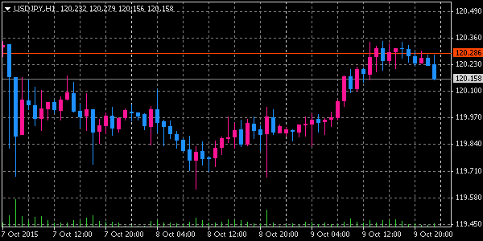

表示項目の設定
====
チャートの表示項目を変更するには、`ChartSetInteger` 関数を使って、各種プロパティを設定します。
指定できるプロパティには下記のようなものがあります。

| プロパティ名 | 設定内容 |
| ------------ | -------- |
| [CHART_MODE](https://www.mql5.com/en/docs/constants/chartconstants/chart_view#enum_chart_mode) | `CHART_BARS`: バーチャート<br>`CHART_CANDLES`: ローソク足<br>`CHART_LINE`: 折れ線 |
| [CHART_SHOW_VOLUMES](https://www.mql5.com/en/docs/constants/chartconstants/chart_view#enum_chart_volume_mode) | `CHART_VOLUME_HIDE`: ボリュームを表示しない<br>`CHART_VOLUME_TICK`: ボリュームとして Tick 数を表示する<br>`CHART_VOLUME_REAL`: ボリュームとして実際の取引量を表示する（サーバによって提供されていないことがある） |
| CHART_SHOW_GRID | `true or false`: グリッドを表示する／しない |
| CHART_SHOW_PERIOD_SEP | `true or false`: 一定期間ごとの縦線を表示する／しない |
| CHART_SHOW_ASK_LINE | `true or false`: 買値の水平線を表示する／しない |
| CHART_SHOW_BID_LINE | `true or false`: 売値の水平線を表示する／しない |
| CHART_SHOW_DATE_SCALE | `true or false`: 日時バー（横の軸）を表示する／しない |
| CHART_SHOW_PRICE_SCALE | `true or false`: 価格バー（縦の軸）を表示する／しない |
| CHART_SHOW_OHLC | `true or false`: 左上の Open/High/Low/Close 価格を表示する／しない（これを false にしても、通貨ペア名と時間足は表示されます） |
| CHART_SHOW_ONE_CLICK | `true or false`: 左上のワンクリック注文パネルを表示する／しない |


#### チャートのプロパティを変更する例
```mql
/**
 * Setup the drawing style of the chart.
 * @param chartId the target chart ID (0 means the current chart)
 */
void setupChart(long chartId = 0) {
    // ローソク足で表示
    if (!ChartSetInteger(chartId, CHART_MODE, CHART_CANDLES)) {
        Print("Could not set chart mode.");
    }

    // 買値 (Ask) ラインを表示
    if (!ChartSetInteger(chartId, CHART_SHOW_ASK_LINE, true)) {
        Print("Could not set Ask line property.");
    }

    // 売値 (Bid) ラインを表示
    if (!ChartSetInteger(chartId, CHART_SHOW_BID_LINE, true)) {
        Print("Could not set Bid line property.");
    }

    ChartRedraw(chartId);
}
```

各種プロパティの変更が実際に画面上に反映されるのは、次のチャートの再描画のタイミングです（例えば、次の tick が発生したとき）。
直ちに設定を画面に反映させたい場合は、[ChartRedraw 関数](https://www.mql5.com/en/docs/chart_operations/chartredraw) を実行します。


色の設定
====
チャートの各描画要素の色を設定する場合も、`ChartSetInteger` 関数を使用します。
カラーを表すプロパティを指定することで、各項目の色を変更します。

| プロパティ名 | 設定内容 |
| ------------ | -------- |
| CHART_COLOR_BACKGROUND | 背景色 |
| CHART_COLOR_FOREGROUND | 価格軸、時間軸、OHLC（Open/High/Low/Close) の色 |
| CHART_COLOR_GRID | グリッド線の色 |
| CHART_COLOR_VOLUME | ボリュームの色 |
| CHART_COLOR_CHART_UP | ローソク足の上昇バーのひげ、および、箱の枠の色 |
| CHART_COLOR_CHART_DOWN | ローソク足の下降バーのひげ、および、箱の枠の色 |
| CHART_COLOR_CHART_LINE | 折れ線チャートの線の色、ローソク足の十字線の色 |
| CHART_COLOR_CANDLE_BULL | 上昇バーの内側の色 |
| CHART_COLOR_CANDLE_BEAR | 下降バーの内側の色 |
| CHART_COLOR_BID | 売値 (Bid) の水平線の色 |
| CHART_COLOR_ASK | 買値 (Ask) の水平線の色 |
| CHART_COLOR_LAST | 最新約定価格の水平線の色 |
| CHART_COLOR_STOP_LEVEL | 決済価格（指値／逆指値）の水平線の色 |

色の指定は `color` 型（4 バイトの数値）で行いますが、[様々な表現で指定](colors.html)することができます。



上記のチャートの配色は、次のようなコードを実行することによって設定することができます。
スクリプトからチャート設定を行うと、一部の設定だけを変更することができるため、使いようによってはテンプレートによる配色変更を行うよりも便利です。

```mql
void setupColors(long chartId = 0) {
    ChartSetInteger(chartId, CHART_COLOR_BACKGROUND, clrBlack);
    ChartSetInteger(chartId, CHART_COLOR_FOREGROUND, clrLightGray);
    ChartSetInteger(chartId, CHART_COLOR_GRID, clrGray);
    ChartSetInteger(chartId, CHART_COLOR_VOLUME, clrLimeGreen);
    ChartSetInteger(chartId, CHART_COLOR_CHART_UP, clrDeepPink);
    ChartSetInteger(chartId, CHART_COLOR_CHART_DOWN, clrDodgerBlue);
    ChartSetInteger(chartId, CHART_COLOR_CHART_LINE, clrOrange);
    ChartSetInteger(chartId, CHART_COLOR_CANDLE_BULL, clrDeepPink);
    ChartSetInteger(chartId, CHART_COLOR_CANDLE_BEAR, clrDodgerBlue);
    ChartSetInteger(chartId, CHART_COLOR_BID, clrDodgerBlue);
    ChartSetInteger(chartId, CHART_COLOR_ASK, clrOrangeRed);
}
```

オブジェクト指向の CChart クラスを使用する
====

`CChart` クラスを使用すると、`ChartSetInteger` のようなプロパティセット関数を使用する代わりに、オブジェクトのメソッドを呼び出すことよって、スマートな記述を行うことができます（なぜか `CHART_SHOW_ONE_CLICK` に相当するメソッドは見つからず・・・）。

下記のスクリプトの `setupChart` 関数は、`CChart` オブジェクトを受け取って、描画スタイルの設定を行っています。

#### scripts/Maku-SetupChart.mq4

```mql
#include <Charts\Chart.mqh>

/**
 * Setup the drawing style of the chart.
 * @param chart the chart object to be set up
 */
void setupChart(CChart& chart) {
    // Show-hide settings
    chart.Mode(CHART_CANDLES);
    chart.ShowOHLC(true);
    chart.ShowLineBid(true);
    chart.ShowLineAsk(true);
    chart.ShowGrid(true);
    chart.ShowPeriodSep(true);
    chart.ShowVolumes(CHART_VOLUME_TICK);
    chart.ShowDateScale(true);
    chart.ShowPriceScale(true);
    chart.Scale(3);

    // Color settings
    chart.ColorBackground(clrBlack);
    chart.ColorForeground(clrLightGray);
    chart.ColorGrid(clrGray);
    chart.ColorVolumes(clrLimeGreen);
    chart.ColorBarUp(clrDeepPink);
    chart.ColorBarDown(clrDodgerBlue);
    chart.ColorChartLine(clrYellow);
    chart.ColorCandleBull(clrDeepPink);
    chart.ColorCandleBear(clrDodgerBlue);
    chart.ColorLineBid(clrDodgerBlue);
    chart.ColorLineAsk(clrOrangeRed);
}

/**
 * Script program start function.
 */
void OnStart() {
    CChart c;
    c.Attach(0);  // 0 means the current chart.
    setupChart(c);
    c.Redraw();
    c.Detach();  // Without detaching, the chart will be closed.
}
```

`CChart` オブジェクトを既存のチャートに関連付けるには、`Attach` メソッドを使用します。
上記の例では、0 を渡すことによって、アクティブなチャートに関連付けています。
`CChart` クラスは、デストラクタ内で関連付けられたチャートを閉じようとします。
チャートが閉じられないようにするには、`Detach` メソッドを読んで、実際のチャートとの関連付けを解除しておかなければいけません。

