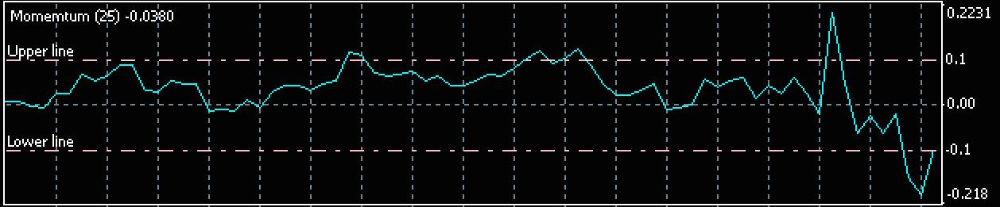

`IndicatorSetXxx()` 系の関数を使用して、インジケータに水平線を表示することができます。
下記の例では、0.1 と -0.1 の値の位置に水平線を表示しています（0.0 の位置には、デフォルトで水平線が表示されるようです）。



```mql
void InitLevelLines() {
    // The number of horizontal lines.
    IndicatorSetInteger(INDICATOR_LEVELS, 2);

    // First line settings.
    IndicatorSetString(INDICATOR_LEVELTEXT, 0, "Upper line");
    IndicatorSetDouble(INDICATOR_LEVELVALUE, 0, 0.1);
    IndicatorSetInteger(INDICATOR_LEVELSTYLE, 0, STYLE_DASHDOT);
    IndicatorSetInteger(INDICATOR_LEVELCOLOR, 0, clrPink);
    IndicatorSetInteger(INDICATOR_LEVELWIDTH, 0, 1);

    // Second line settings.
    IndicatorSetString(INDICATOR_LEVELTEXT, 1, "Lower line");
    IndicatorSetDouble(INDICATOR_LEVELVALUE, 1, -0.1);
    IndicatorSetInteger(INDICATOR_LEVELSTYLE, 1, STYLE_DASHDOT);
    IndicatorSetInteger(INDICATOR_LEVELCOLOR, 1, clrPink);
    IndicatorSetInteger(INDICATOR_LEVELWIDTH, 1, 1);
}

int OnInit() {
    ...
    InitLevelLines();
    ...
    return INIT_SUCCEEDED;
}
```
