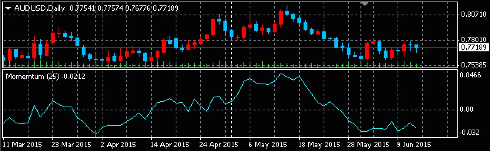

モメンタムは下記の計算式で求められます。

```
モメンタム = 現在の価格 - X日前の価格
```

ある一定期間前の価格と比べ、現在の価格がどれだけ上下しているかを示すため、相場の勢いを知るために使用されます。
どれくらい前の価格と比較するかは、一般的に下記のような値が使用されます。

* 日足の場合: 10日、25日
* 週足の場合: 9週、13週、26週
* 月足の場合: 3ヶ月、6ヶ月、9ヶ月

モメンタムは価格の差分を表すため、通常は下記のように別ウィンドウに表示します。



#### Momentum.mq4
```mql
#property copyright "Maku"
#property version   "1.00"

// Global settings
#property description "Momentum"
#property strict
#property indicator_separate_window
#property indicator_buffers 1
#property indicator_plots   1

// Indicator settings
#property indicator_type1   DRAW_LINE
#property indicator_color1  clrCyan
#property indicator_style1  STYLE_SOLID
#property indicator_width1  1

// Input parameters
input int gPeriod = 25;  // Momentum Period

// Indicator bufferes
double gMomentumBuffer[];

// Initialize the indicator.
int OnInit() {
    if (gPeriod <= 0) {
        Alert("Period must be larger than 0");
        return INIT_PARAMETERS_INCORRECT;
    }
    
    string label = StringFormat("Momemtum (%i)", gPeriod);
    SetIndexBuffer(0, gMomentumBuffer);
    SetIndexLabel(0, label);
    IndicatorShortName(label);

    return INIT_SUCCEEDED;
}

/**
 * [Utility]
 * How many candles should be re-calculated.
 */
int changedBars(int rates_total, int prev_calculated) {
    if (prev_calculated == 0) {
        return rates_total;
    }
    // The latest bar should be updated, so add 1.
    return rates_total - prev_calculated + 1;
}

int calcMomentum(double &buf[], const double &price[],
        int price_total, int changed, int period) {
    // Needs adequate price data for calculating
    if (price_total < period) {
        ArrayFill(buf, 0, price_total, EMPTY_VALUE);
        return 0;
    }

    // Update momentum buffer
    int count = MathMin(changed, price_total - period);
    for (int i = 0; i < count; ++i) {
        buf[i] = price[i] - price[i + period];
    }
    
    return price_total;
}

// Handle change of a tick
int OnCalculate(const int rates_total,
                const int prev_calculated,
                const datetime &time[],
                const double &open[],
                const double &high[],
                const double &low[],
                const double &close[],
                const long &tick_volume[],
                const long &volume[],
                const int &spread[]) {
    int changed = changedBars(rates_total, prev_calculated);
    calcMomentum(gMomentumBuffer, close, rates_total, changed, gPeriod);
    
    // return value of prev_calculated for next call
    return rates_total;
}
```
