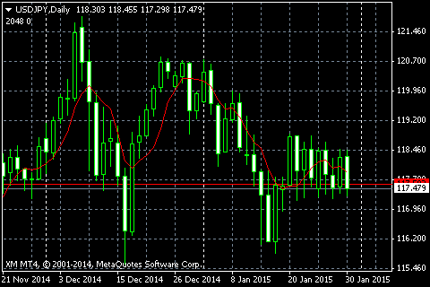

移動平均線を表示するためのインジケータはデフォルトで用意されていますが、ここでは勉強のためにインジケータを自作してみます。



#### MySma.mt4
```mql
#property description "My Moving Average"
#property strict
#property indicator_chart_window
#property indicator_buffers 1
#property indicator_plots   1

// Indicator settings
#property indicator_label1  "MA"
#property indicator_type1   DRAW_LINE
#property indicator_color1  clrRed
#property indicator_style1  STYLE_SOLID
#property indicator_width1  1

// Input parameters
input int gPeriod = 7; // MA Period

// Indicator buffers
double gMaBuffer[];

int OnInit() {
    if (gPeriod <= 0) {
        Alert("Period must be larger than 0");
        return INIT_PARAMETERS_INCORRECT;
    }
    SetIndexBuffer(0, gMaBuffer); 
    IndicatorShortName("MA(" + gPeriod + ")");
    return INIT_SUCCEEDED;
}

/**
 * [Utility]
 * How many candles should be re-calculated.
 */
int changedBars(int rates_total, int prev_calculated) {
    if (prev_calculated == 0) {
        return rates_total;
    }
    // The latest bar should be updated, so add 1.
    return rates_total - prev_calculated + 1;
}

/**
 * Calculate average of vals[index .. index+count)
 */
double average(const double &vals[], int index, int count) {
    double sum = 0.0;
    for (int i = 0; i < count; ++i) {
        sum += vals[index + i];
    }
    return sum / count;
}

/**
 * Updates a moving average buffer.
 *
 * Parameters:
 *   buf -- the buffer where calculated MA is stored
 *   price -- the price used for calculating the MA
 *   price_count -- the number of prices
 *   changed -- price[0..changed-1] has been updated
 *   period -- MA's period
 */
void calcMovingAverage(double &buf[], const double &price[], int price_count,
        int changed, int period) {
    // Needs adequate price data for calculating MA.
    if (price_count < period) {
        ArrayFill(buf, 0, price_count, EMPTY_VALUE);
        return;
    }

    // Update each MA
    int count = MathMin(changed, price_count - period + 1);
    for (int i = 0; i < count; ++i) {
        buf[i] = average(price, i, period);
    }
}

int OnCalculate(const int rates_total,
                const int prev_calculated,
                const datetime &time[],
                const double &open[],
                const double &high[],
                const double &low[],
                const double &close[],
                const long &tick_volume[],
                const long &volume[],
                const int &spread[]) {
    if (rates_total < gPeriod) {
        return 0;
    }

    int changed = changedBars(rates_total, prev_calculated);
    calcMovingAverage(gMaBuffer, close, rates_total, changed, gPeriod);

    return rates_total;
}
```

コード説明
====

```mql
// Input parameters
input int gPeriod = 7; // MA Period
```

何本のローソク足を使って平均値を求めるかを示す変数です。**input** キーワードを使うことで、インジケータをチャートにセットするときに、ユーザが自由に値を変更できるようになります。そのときにデフォルトでは変数名が表示されるのですが、上記のように、変数宣言の後ろにコメントを記載しておくと、そのテキストが代わりに表示されるようになります。

```mql
// Indicator buffers
double gMaBuffer[];

int OnInit() {
    if (gPeriod <= 0) {
        Alert("Period must be larger than 0");
        return INIT_PARAMETERS_INCORRECT;
    }
    SetIndexBuffer(0, gMaBuffer); 
    IndicatorShortName("MA(" + gPeriod + ")");
    return INIT_SUCCEEDED;
}
```

今回は、移動平均線を一本だけ表示するので、指標バッファをひとつだけ (`gMaBuffer`) 用意しています。

```mql
void calcMovingAverage(double &buf[], const double &price[], int price_count,
        int changed, int period) {
    // Needs adequate price data for calculating MA.
    if (price_count < period) {
        ArrayFill(buf, 0, price_count, EMPTY_VALUE);
        return;
    }

    // Update each MA
    int count = MathMin(changed, price_count - period);
    for (int i = 0; i < count; ++i) {
        buf[i] = average(price, i, period);
    }
}

int OnCalculate(...) {
    int changed = changedBars(rates_total, prev_calculated);
    calcMovingAverage(gMaBuffer, close, rates_total, changed, gPeriod);
    return rates_total;
}
```

`OnCalculate` 関数では、実際に移動平均を求めていきます。
ローソク足の数（`rates_total`）が移動平均区間に満たない場合は、移動平均を求めることはできないので、そのまま return しています。
その後、各ローソク足から見て、指定区間分の合計を求めて平均を出しています。
よく考えると、各計算で重複した期間を合計しているので、もう少し計算を効率化できることが分かります。

