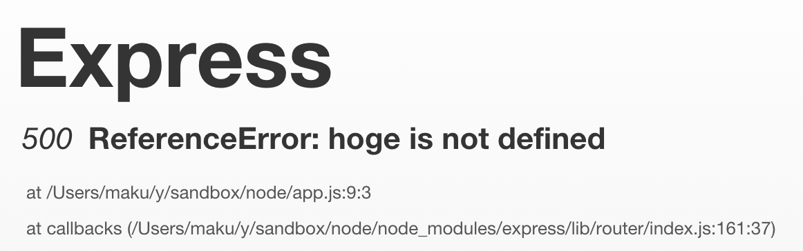

Express サーバで、インターナルサーバエラー (5xx) が発生した場合、クライアントの Web ブラウザには、デフォルトでそっけないテキストのスタックトレースが表示されます。
Express が提供している `errorHandler` ミドルウェアを適用すると、もう少しリッチな Internal Server Error のページを表示できます。

```javascript
app.use(app.router);
app.use(express.errorHandler());
```

#### 表示例（サーバ側で存在しないメソッド hoge を呼び出した場合）



Express 4 では、ミドルウェアが Express から独立したモジュール (`errorhandler`) に分けられたので、下記のようにすべしとドキュメントに書いてあります。

```javascript
// Express 4 以降
var errorhandler = require('errorhandler');
app.use(errorhandler());
```

ただし、現時点 (2014-09-22) では `errorhandler` ミドルウェアはうまく動作しないようです。
単純に、`NODE_ENV=development`（デフォルト）でクライアントの Web ブラウザ上にスタックトレースが表示され、`NODE_ENV=production` でスタックトレース表示が抑制されるように動作します。

下記バージョンで確認:

* node 0.10.32
* express 4.9.4
* errorhandler 1.2.0

