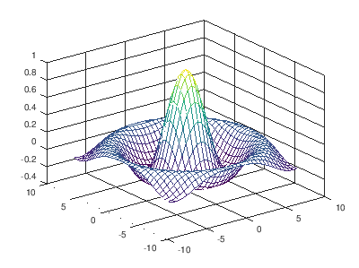

カレントディレクトリを移動する
----

Octave では、カレントディレクトリに `任意の名前.m` というファイル名でスクリプトを作成しておくと、下記のようにしてそのスクリプトを実行することができます。

~~~ matlab
>> 任意の名前
~~~

カレントディレクトリがどこになっているかを確認するには、`pwd` コマンドを実行します。

~~~ matlab
>> pwd
ans = C:\Users\maku
~~~

カレントディレクトリを移動するには、`cd` コマンドを実行します。
スクリプトを格納したディレクトリに移動しましょう。

~~~ matlab
>> cd D:    % D ドライブのルートへ移動
~~~

スクリプトを実行してみる
----

ここでは、下記のようなスクリプトファイルを用意してみます。

#### myscript.m

~~~ matlab
[X, Y] = meshgrid(-8:.5:8);
R = sqrt(X.^2 + Y.^2) + eps;
Z = sin(R) ./ R;
figure
mesh(X, Y, Z)
~~~

このファイルが置いてあるディレクトリに移動して、拡張子 `.m` を除いた部分の名前を入力すると、スクリプトを実行できます。

~~~
>> cd somewhere
>> myscript
~~~

すると、下記のようなグラフが描画されます。

