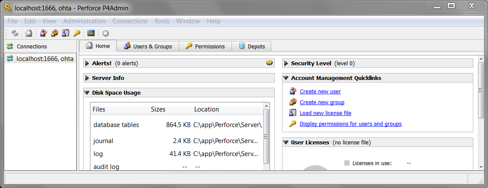
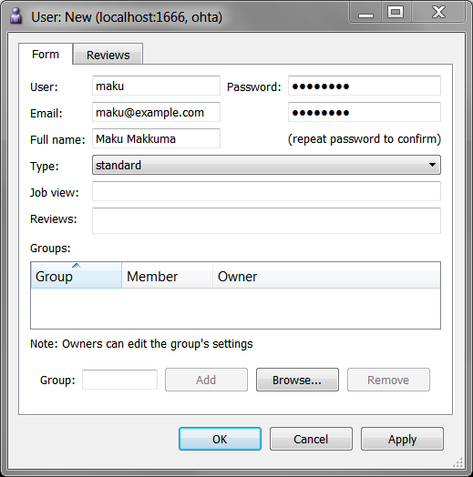

p4admin を起動する
====
Perforce サーバの設定を行うには、**p4admin** を使って、サーバに接続します。
最初に接続したユーザが、管理ユーザとして登録されます。

例えば、ローカルホストで動いているサーバに対して、ユーザ ohta で接続するのであれば、以下のように実行します。

```
$ p4admin -p localhost:1666 -u ohta
```



Perforce サーバにユーザアカウントを追加する
====
最初に p4admin に接続したユーザは、既に作成された状態になっていますが、さらに Perforce サーバに接続可能なユーザを追加するには、Home タブの `Create new user` を選択するか、メニューから `File => New => User...` と辿ります。



ここでは初期パスワードを設定できますが、ユーザ作成後のパスワード変更は、各ユーザが `p4 passwd` コマンドを使用して行います（p4admin ツールの中ではパスワード変更できません）。

```
$ p4 -p localhost:1666 -u maku passwd
```

