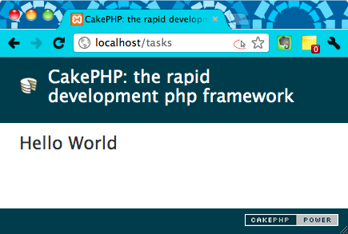
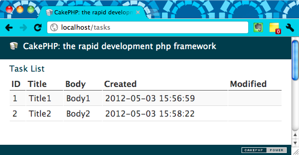

まずは Controller と View を作ってみる
----

まずは、以下のような URL で Hello World を表示するようにしてみましょう。

~~~
http://localhost/tasks/index
（あるいは）
http://localhost/tasks
~~~

最低限必要なファイルは以下の 2 つです。

* `app/Controller/TasksController.php`（Controller 定義）
* `app/View/Tasks/index.ctp`（View 定義）

`http://localhost/tasks/*` という URL にアクセスがあると、自動的に `TasksController.php` という名前の `Controller` クラスが処理を受け付けるようになっています。
まずは、このクラスに `index` メソッドを追加します。

#### app/Controller/TasksController.php

~~~ php
<?php
class TasksController extends AppController {
    public function index() {
    }
}
~~~

上記のような `TasksController.php` を作成すると、`http://localhost/tasks/index` という URL でアクセスできるようになります。
でも、まだ表示内容 (view) の定義がないので、警告画面が表示されるはずです。
view の定義は、`cts` という拡張子を持つ HTML テンプレートで行います。

`TasksController` がリクエストを処理すると、HTML テンプレートとして、自動的に `app/View/Tasks/<Action名>.cts` というファイルが使用されます。

例えば、`http://localhost/tasks/index` にアクセスがあると、`TasksController` クラスの `index` メソッドが呼び出され、テンプレートとして `index.ctp` が使用されます。

#### app/View/Tasks/index.ctp

~~~ html

Hello World

~~~

`http://localhost/tasks` にアクセスして、以下のような感じで Hello World のページが表示されれば成功です。

Hello World というテキスト以外にもヘッダやフッタが表示されていますが、これらの表示内容は、`app/View/Layouts/default.ctp` で定義されています。

Model クラスを作成し、データベースの内容を表示してみる
----

Model クラスを作成すると、データベースのレコードに透過的にアクセスできるようになります。
ここでも名前が重要です。
例えば、`tasks` テーブルの 1 レコードを表すには、`Task` という名前の Model クラスを用意し、以下のパスに保存します。

* `app/Model/Task.php`（Model 定義）

テーブル名は複数形 (tasks) ですが、Model クラスは 1 レコード分のデータを表すので、`Task.php` というように単数系で定義します。

#### app/Model/Task.php

~~~ php
<?php
class Task extends AppModel {
}
~~~

`http://localhost/tasks/index という` URL でアクセスしたときに、`tasks` テーブル内のレコードの内容を列挙するために、Controller と View を修正します。

#### app/Controller/TasksController.php

~~~ php
<?php
class TasksController extends AppController {
    public function index() {
        $tasks = $this->Task->find('all');
        $this->set('tasks', $tasks);
    }
}
~~~

Controller の `set` メソッドを使うと、View のテンプレートから参照可能な View 変数を設定することができます。
`$this->set(＜変数名＞, ＜値＞)` としておくと、テンプレート内から `$変数名` のようにアクセスできるようになります。

上記の例では、`Task->find()` の戻り値である連想配列を、テンプレートから参照できるようにしています。

#### app/View/Tasks/index.ctp

~~~ html
<h1>Task List</h1>

<table>
    <tr>
        <th>ID</th>
        <th>Title</th>
        <th>Body</th>
        <th>Created</th>
        <th>Modified</th>
    </tr>
    <?php foreach ($tasks as $t): ?>
    <tr>
        <td><?php echo $t['Task']['id'] ?></td>
        <td><?php echo $t['Task']['title'] ?></td>
        <td><?php echo $t['Task']['body'] ?></td>
        <td><?php echo $t['Task']['created'] ?></td>
        <td><?php echo $t['Task']['modified'] ?></td>
    </tr>
    <?php endforeach; ?>
</table>
~~~

ページをリロードして、以下のように表示されれば成功です。

table のスタイルシートもデフォルトで設定されていて、いい感じですね。

CakePHP 入門記事一覧
----

- [CakePHP 入門 (1) セットアップ](./abc-1.html)
- [CakePHP 入門 (2) データベースの設定](./abc-2.html)
- [CakePHP 入門 (3) CakePHP アプリの URL の仕組み](./abc-3.html)
- CakePHP 入門 (4) Controller、View、Model を作成する
- [CakePHP 入門 (5) 個別のレコードを表示する](./abc-5.html)
- [CakePHP 入門 (6) ヘルパーを使用してリンクを生成する](./abc-6.html)
- [CakePHP 入門 (7) レコードを追加できるようにする](./abc-7.html)
- [CakePHP 入門 (8) レコードを編集できるようにする](./abc-8.html)
- [CakePHP 入門 (9) レコードを削除できるようにする](./abc-9.html)

