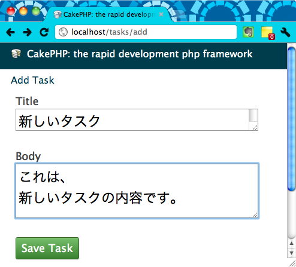
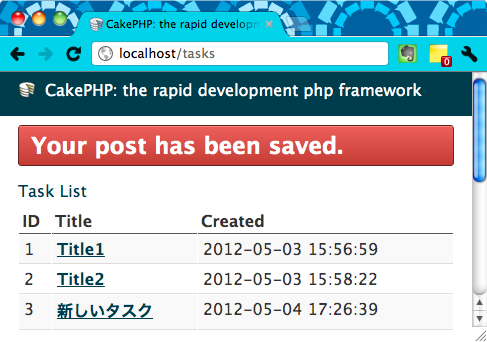
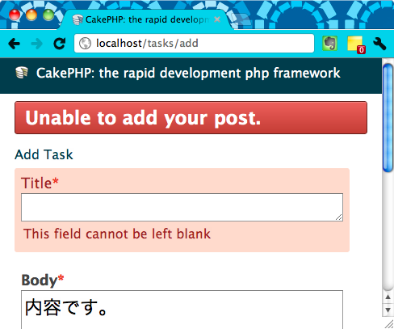

まず、Controller に新しい Action として `add()` を追加し、対応するテンプレートとして、`add.ctp` を作成します。

#### app/Controller/TasksController.php

~~~ php
<?php
class TasksController extends AppController {
    public $components = array('Session');
    ...
    public function add() {
        if ($this->request->is('post')) {
            if ($this->Task->save($this->request->data)) {
                $this->Session->setFlash('Your post has been saved.');
                $this->redirect(array('action' => 'index'));
            } else {
                $this->Session->setFlash('Unable to add your post.');
            }
        }
    }
}
~~~

#### app/View/Tasks/add.ctp

~~~ php
<h1>Add Task</h1>
<?php
    echo $this->Form->create('Task');
    echo $this->Form->input('title', array('rows' => '1'));
    echo $this->Form->input('body', array('rows' => '3'));
    echo $this->Form->end('Save Task');
?>
~~~

ここでは、ちょっとしたテクニックを使って、以下の 2 種類の処理を、1 つの Action (add) で行えるようにしています。

* ユーザへの入力フォームの表示
* ユーザから入力を受け取って、データベースの更新

まず、ユーザが `http://localhost/tasks/add` というアドレスで直接ページを開くと、GET リクエストでアクセスされるので、

~~~ php
if ($this->request->is('post'))
~~~

という条件分岐は `false` と判定され、`add.ctp` テンプレートの内容がユーザに表示されます。

その後、ユーザがフォームに入力して、Save ボタンを押すと、今度は、POST メソッドでリクエストが発生するため、

~~~ php
if ($this->request->is('post'))
~~~

という条件分岐が `true` と判定されます。
すると、入力データの保存処理 (`$this->Task->save`) が行われ、最後には `index` アクションにリダイレクト (`$this->redirect`) が行われて、一覧表示のページへ移動するようになっています。

空の情報を登録できないようにする
----

Validation の機能を使うと、入力データのチェックをして、不正な入力を防ぐことができます。
例えば、タイトル (title) や内容 (body) を空のまま submit するのを防ぐには、以下のように、Model クラスを拡張します。

#### app/Model/Task.php

~~~ php
<?php
class Task extends AppModel {
    public $validate = array(
        'title' => array('rule' => 'notEmpty'),
        'body' => array('rule' => 'notEmpty')
    );
}
~~~

入力フォームでは、入力必須のフィールドに印が表示されるようになり、空のまま submit しようとすると、以下のようなエラー画面が表示されるようになります。

CakePHP 入門記事一覧
----

- [CakePHP 入門 (1) セットアップ](./abc-1.html)
- [CakePHP 入門 (2) データベースの設定](./abc-2.html)
- [CakePHP 入門 (3) CakePHP アプリの URL の仕組み](./abc-3.html)
- [CakePHP 入門 (4) Controller、View、Model を作成する](./abc-4.html)
- [CakePHP 入門 (5) 個別のレコードを表示する](./abc-5.html)
- [CakePHP 入門 (6) ヘルパーを使用してリンクを生成する](./abc-6.html)
- CakePHP 入門 (7) レコードを追加できるようにする
- [CakePHP 入門 (8) レコードを編集できるようにする](./abc-8.html)
- [CakePHP 入門 (9) レコードを削除できるようにする](./abc-9.html)

