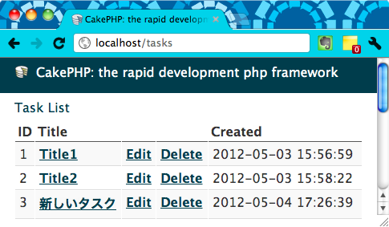

ここでは、指定した ID のレコードを削除できるようにします。
`http://localhost/tasks` にアクセスしたときに、以下のように Delete リンクを表示するようにします。

ただし、単純な GET リクエストでレコードを削除できるようにしてしまうと、ブラウザに URL を入力したときや、Web クローラのアクセスだけで削除されてしまうので、削除には必ず POST リクエストを使うように制限します。

以下のように、`TasksController` に `delete` アクションを追加します。

#### app/Controller/TasksController.php

~~~ php
<?php
class TasksController extends AppController {
    public $components = array('Session');
    ...
    public function delete($id) {
        if ($this->request->is('get')) {
            throw new MethodNotAllowedException();
        }
        if ($this->Task->delete($id)) {
            $this->Session->setFlash('The task has been deleted.');
            $this->redirect(array('action' => 'index'));
        }
    }
}
~~~

delete 用のページは作らずに、一覧ページ (index) のリンクから削除できるようにします。
POST リクエストを使うリンクを生成するには、`FormHelper` の `postLink()` を使用します。

~~~ php
$this->Form->postLink('Delete',
    array('action' => 'delete', $id),
    array('confirm' => 'Are you sure?'));
~~~

#### app/View/Tasks/index.ctp

~~~ php
<h1>Task List</h1>

<table>
    <tr>
        <th>ID</th><th>Title</th><th></th><th></th><th>Created</th>
    </tr>
    <?php foreach ($tasks as $t):
        $id = $t['Task']['id'];
        $title = $t['Task']['title'];
        $created = $t['Task']['created'];
    ?>
    <tr>
        <td><?php echo $id ?></td>
        <td><?php echo $this->Html->link($title,
            array('controller' => 'tasks', 'action' => 'view', $id)) ?></td>
        <td><?php echo $this->Html->link('Edit',
            array('controller' => 'tasks', 'action' => 'edit', $id)) ?></td>
        <td><?php echo $this->Form->postLink('Delete',
            array('controller' => 'tasks', 'action' => 'delete', $id),
            array('confirm' => 'Are you sure?')) ?></td>
        <td><?php echo $created ?></td>
    </tr>
    <?php endforeach; ?>
</table>
~~~

CakePHP 入門記事一覧
----

- [CakePHP 入門 (1) セットアップ](./abc-1.html)
- [CakePHP 入門 (2) データベースの設定](./abc-2.html)
- [CakePHP 入門 (3) CakePHP アプリの URL の仕組み](./abc-3.html)
- [CakePHP 入門 (4) Controller、View、Model を作成する](./abc-4.html)
- [CakePHP 入門 (5) 個別のレコードを表示する](./abc-5.html)
- [CakePHP 入門 (6) ヘルパーを使用してリンクを生成する](./abc-6.html)
- [CakePHP 入門 (7) レコードを追加できるようにする](./abc-7.html)
- [CakePHP 入門 (8) レコードを編集できるようにする](./abc-8.html)
- CakePHP 入門 (9) レコードを削除できるようにする

