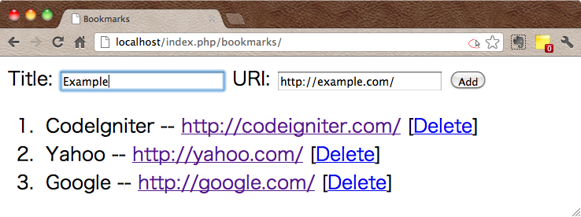

Active Recode による CRUD 操作
----

CodeIgniter の `Database` クラスは、データベースの **CRUD** 操作を、Active Recode パターンで処理する機能を備えています。
CRUD は以下の操作を表す頭文字で、

- **C** - Create (INSERT)
- **R** - Read (SELECT)
- **U** - Update (UPDATE)
- **D** - Delete (DELETE)

それぞれ、Database クラスの以下のようなメソッドが対応しています。

~~~ php
$this->db->insert();
$this->db->get();
$this->db->update();
$this->db->delete();
~~~

サンプルテーブルの作成
----

サンプルデータとして、以下のように `bookmarks` テーブルを作っておきます。

#### bookmarks.sql

~~~ sql
CREATE TABLE IF NOT EXISTS bookmarks(
    id INT NOT NULL AUTO_INCREMENT,
    title TEXT,
    uri TEXT,
    PRIMARY KEY (id)
);

INSERT INTO bookmarks(title, uri)
    VALUES ('Google', 'http://google.com/'),
           ('Yahoo', 'http://yahoo.com/'),
           ('CodeIgniter', 'http://codeigniter.com/');
~~~

#### データベースの作成

~~~
$ mysql -u root
mysql> GRANT ALL PRIVILEGES ON test_db.* TO test_user@localhost IDENTIFIED BY 'test_password';
mysql> CREATE DATABASE test_db;
~~~

#### テーブルの作成

~~~
$ mysql -u test_user -p test_db < bookmarks.sql
Enter password: test_password
~~~

モデルクラスの作成
----

`Bookmarks_model` クラスには、CRUD 操作を行うためのメソッドをそれぞれ定義します。

#### Bookmarks_model モデル (application/models/bookmarks_model.php)

~~~ php
<?php
class Bookmarks_model extends CI_Model {
    const TABLE_NAME = 'bookmarks';
    const COL_ID = 'id';

    public function __construct() {
        parent::__construct();
        $this->load->database();
    }

    public function get() {
        $query = $this->db->get(self::TABLE_NAME);
        return $query->result();
    }

    public function insert($data) {
        $this->db->insert(self::TABLE_NAME, $data);
    }

    public function update($id, $data) {
        $this->db->where(self::COL_ID, $id);
        $this->db->update(self::TABLE_NAME, $data);
    }

    public function delete($id) {
        $this->db->where(self::COL_ID, $id);
        $this->db->delete(self::TABLE_NAME);
    }
}
~~~

コントローラーの作成
----

`Bookmarks` コントローラーの `index` アクションは、現在のレコードをすべて取得して `index.php` ビューで表示するように実装します。

また、`create` や `delete` アクションが呼び出されると、POST された情報に基づいてレコードの作成と削除が行われます。

#### Bookmarks コントローラー (application/controllers/bookmarks.php)

~~~ php
<?php
class Bookmarks extends CI_Controller {
    public function __construct() {
        parent::__construct();
        $this->load->model('bookmarks_model');
        $this->load->helper('url');  // anchor, auto_link
        $this->load->helper('form');  // form_open, form_close
    }

    public function index() {
        $data['bookmarks'] = $this->bookmarks_model->get();
        $this->load->view('bookmarks_index', $data);
    }

    public function create() {
        $bookmark = array(
            'title' => $this->input->post('title'),
            'uri' => $this->input->post('uri')
        );
        $this->bookmarks_model->insert($bookmark);
        $this->index();
    }

    public function delete($id) {
        $this->bookmarks_model->delete($id);
        $this->index();
    }
}
~~~

ビューの作成
----

ここでは、ひとつのビューに新規レコード作成用のフォームを表示し、その下に全てのレコードを列挙するようにしてみます。

#### bookmarks_index ビュー (application/views/bookmarks_index.php)

~~~ php
<!DOCTYPE html>
<html>
<head>
    <meta charset="utf-8" />
    <title>Bookmarks</title>
</head>
<body>

<!-- 新規レコード作成用フォーム -->
<?php echo form_open('bookmarks/create'); ?>
    <label for="title">Title:</label>
    <input type="text" name="title" id="title" size="30" />
    <label for="uri">URI:</label>
    <input type="text" name="uri" id="uri" size="30" />
    <input type="submit" value="Add" />
<?php echo form_close(); ?>

<!-- 全てのレコードを列挙 -->
<ol>
    <?php foreach($bookmarks as $it) : ?>
        <li><?php echo $it->title; ?> --
            <?php echo auto_link($it->uri); ?>
            [<?php echo anchor("bookmarks/delete/$it->id", "Delete"); ?>]
    <?php endforeach; ?>
</ol>

</body></html>
~~~

