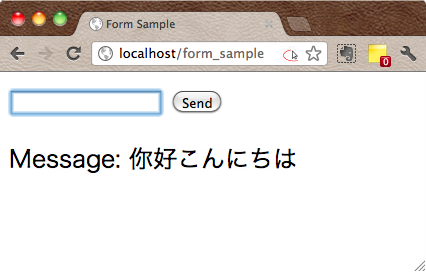

**Input クラス**を利用すると、フォームで入力された値を、コントローラから参照することができます（Input クラスはデフォルトでロードされるため、明示的にロードする必要はありません）。

例えば、`<input type="text" name="input_name" />` というテキストエリアに入力された内容は、コントローラーの中で以下のように取得することができます。

~~~ php
$this->input->post('input_name');  // POST メソッドの場合
$this->input->get('input_name');   // GET メソッドの場合
~~~

入力が空の場合は、どちらのメソッドも `FALSE` を返します。

第２引数で `TRUE` を指定すると、XSS（クロスサイトスクリプティング）のフィルタが有効になり、入力が適切にエスケープされます。例えば、`<!--ABC` という入力は、`&lt;!--ABC` のように自動的にエスケープされます。

以下のサンプルは、フォームのテキストボックスに入力された文字列を、同じ画面の下に表示します。

#### 実行画面

#### form_sample ビュー (application/views/form_sample.php)

~~~ php
<DOCTYPE! html>
<html>
  <head>
    <meta charset="UTF-8">
    <title>Form Sample</title>
  </head>
  <body>
    <?php echo form_open('form_sample'); ?>
      <input type="text" name="message" />
      <input type="submit" value="Send" />
    </form>
    Message: <?= $message; ?>
  </body>
</html>
~~~

#### Form_sample コントローラー (application/controllers/form_sample.php)

~~~ php
<?php
class Form_sample extends CI_Controller {
    public function index() {
        $this->load->helper('form');  // form_open

        $msg = $this->input->post('message', TRUE);
        if (! $msg) {
            $msg = 'Empty';
        }
        $data = array('message' => $msg);
        $this->load->view('form_sample', $data);
    }
}
~~~

