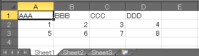

xlrd パッケージのインストール
----

**xlrd** パッケージを使用すると、Python で簡単に Excel ファイルを扱うことができます（xls 拡張子のファイルも、xlsx 拡張子のファイルも両方読み込めます）。
xlrd パッケージは `pip` コマンドを使用してインストールできます。

```
$ pip install xlrd
```

xlrd パッケージの GitHub リポジトリは[こちら (python-excel/xlrd)](https://github.com/python-excel/xlrd)。
なお、xlrd パッケージは読み込み専用で、書き込み用には [xlwt](https://github.com/python-excel/xlwt) が用意されています。


xlrd で Excel シートを読み込む
----

ここでは、下記のように３つのシートを含む Excel ファイル (data.xlsx) を読み込んでみます。

#### data.xlsx




### ブック内のシートの情報を取得する

Excel ファイル（＝ブック）に含まれているシートの数や、シートの名前を取得するには下記のようにします。

#### sample.py

~~~ python
import xlrd

# Excel ファイル（ブック）を読み込み
book = xlrd.open_workbook('data.xlsx')

# ブック内のシート数を取得
num_of_worksheets = book.nsheets
print(num_of_worksheets)  #=> 3

# 全シートの名前を取得
sheet_names = book.sheet_names()
print(sheet_names)  #=> ['Sheet1', 'Sheet2', 'Sheet3']
~~~

個々のシート内の詳細情報を参照するには、`book.sheet_by_index()` や `book.sheet_by_name()` メソッドなどを使用して、`Sheet` オブジェクトを取得します。
次の例では、すべてのシートをループ処理して、それぞれのシートに含まれているデータの行数 (rows)、列数 (cols) を調べています。

#### sample.py

~~~ python
import xlrd

book = xlrd.open_workbook('data.xlsx')
for i in range(book.nsheets):
    sheet = book.sheet_by_index(i)
    print('{} has {} rows and {} cols'.format(sheet.name, sheet.nrows, sheet.ncols))
~~~

#### 実行結果

~~~
Sheet1 has 3 rows and 4 cols
Sheet2 has 0 rows and 0 cols
Sheet3 has 0 rows and 0 cols
~~~

### シート内の各セルの値を取得する

下記の例では、１つ目のシートに含まれているすべてのセルの値を出力しています。

#### sample.py

~~~ python
import xlrd

book = xlrd.open_workbook('data.xlsx')
sheet = book.sheet_by_index(0)

for row_index in range(sheet.nrows):
    for col_index in range(sheet.ncols):
        val = sheet.cell_value(rowx=row_index, colx=col_index)
        print('cell[{},{}] = {}'.format(row_index, col_index, val))
~~~

#### 実行結果

~~~
cell[0,0] = AAA
cell[0,1] = BBB
cell[0,2] = CCC
cell[0,3] = DDD
cell[1,0] = 1.0
cell[1,1] = 2.0
cell[1,2] = 3.0
cell[1,3] = 4.0
cell[2,0] = 5.0
cell[2,1] = 6.0
cell[2,2] = 7.0
cell[2,3] = 8.0
~~~

下記のように、行 (row) ごとにまとめてリストで取得することもできます。

~~~ python
for row_index in range(sheet.nrows):
    row = sheet.row(row_index)  # 一行分の xlrd.sheet.Cell のリスト
    print(row)
~~~

#### 実行結果

~~~
[text:'AAA', text:'BBB', text:'CCC', text:'DDD']
[number:1.0, number:2.0, number:3.0, number:4.0]
[number:5.0, number:6.0, number:7.0, number:8.0]
~~~

上記のように取得した行ごとのデータは、具体的には `xlrd.sheet.Cell` オブジェクトのリストになっており、下記のようにすれば `Cell` オブジェクトをひとつずつ処理することができます。

~~~ python
for row_index in range(sheet.nrows):
    row = sheet.row(row_index)  # 一行分の xlrd.sheet.Cell のリスト
    for cell in row:
        print(cell.value)
~~~

`sheet.row` の代わりに、`sheet.row_values` を使用すると、`xlrd.sheet.Cell` のリストではなく、一行分の「値」のリストを取得することができます。

~~~ python
for row_index in range(sheet.nrows):
    row = sheet.row_values(row_index)  # 一行分の「値」のリスト
    print(row[0], row[1], row[2], row[3])
~~~

