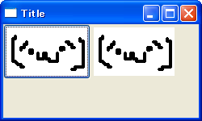
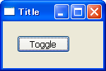
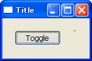

ボタンにイベントハンドラを関連付ける
----


`wx.Button` が押されたことを知るには、`wx.EVT_BUTTON` イベントを処理します。
次の例では、`wx.Button` が押されたときに、フレームを閉じています。

#### 実装例

```python
import wx

class MyFrame(wx.Frame):
    def __init__(self):
        wx.Frame.__init__(self, None, -1, "Title", size=(150,100))
        button = wx.Button(self, -1, "Close")
        button.Bind(wx.EVT_BUTTON, self.OnCloseButton)

    def OnCloseButton(self, event):
        self.Close()

if __name__ == '__main__':
    app = wx.PySimpleApp()
    MyFrame().Show()
    app.MainLoop()
```


ビットマップ・ボタンを作成する
----



`wx.Bitmap` のサブクラスである `wx.BitmapButton` を使うと、ボタンとして画像を表示することができます。
デフォルトのスタイルとして `wx.BU_AUTODRAW` が設定されており、画像の周りに 3D のボーダーが表示されます。
このボーダーを表示しないようにするには、コンストラクタの `style` パラメータで `wx.BU_AUTODRAW` フラグをセットしないようにします。

#### 実装例

```python
import wx

class MyFrame(wx.Frame):
    def __init__(self):
        wx.Frame.__init__(self, None, -1, 'Title', size=(250,150))

        # Create widgets.
        panel = wx.Panel(self)
        bmp = wx.Image('button.png', wx.BITMAP_TYPE_PNG).ConvertToBitmap()
        b1 = wx.BitmapButton(panel, -1, bmp)
        b2 = wx.BitmapButton(panel, -1, bmp, style=0)

        # Set sizer.
        sizer = wx.BoxSizer(wx.HORIZONTAL)
        sizer.Add(b1)
        sizer.Add(b2)
        panel.SetSizer(sizer)

if __name__ == '__main__':
    app = wx.PySimpleApp()
    MyFrame().Show(True)
    app.MainLoop()
```


トグル・ボタンを使用する
----





`wx.Button` のサブクラスである `wx.ToggleButton` を使用すると、「押された状態 (`True`)」と「押されていない状態 (`False`)」の 2 つの値を持つトグル・ボタンを作成できます。

`wx.ToggleButton` を押したときは、`wx.EVT_BUTTON` ではなく、`wx.EVT_TOGGLEBUTTON` イベントが発生します。
`wx.ToggleButton` の状態は、`GetValue()` で取得、`SetValue()` で設定することができます。

#### 実装例

```python
import wx

class MyFrame(wx.Frame):
    def __init__(self):
        wx.Frame.__init__(self, None, -1, "Title", size=(150,100))
        panel = wx.Panel(self)
        self.button = wx.ToggleButton(panel, -1, "Toggle", pos=(20,20))
        self.button.Bind(wx.EVT_TOGGLEBUTTON, self.OnToggleButton)

    def OnToggleButton(self, event):
        print self.button.GetValue()

if __name__ == '__main__':
    app = wx.PySimpleApp()
    MyFrame().Show(True)
    app.MainLoop()
```


ボタンのサイズを取得する
----

```python
# button = wx.Button(...)

size = button.GetSize()
w = button.GetSize().width
h = button.GetSize().height
```


もっとリッチなボタンを使用する
----

下記のコンポーネントを参照。

- wx.lib.buttons.GenBitmap
- wx.lib.buttons.GenBitmapTextButton
- wx.lib.buttons.GenBitmapToggleButton

