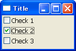
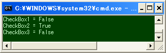

チェックボックスを使用する
----





`wx.CheckBox` はチェックボックスを提供します。

```python
wx.CheckBox#__init__(self, Window parent, int id=-1, String label=EmptyString,
    Point pos=DefaultPosition, Size size=DefaultSize,
    long style=0, Validator validator=DefaultValidator,
    String name=CheckBoxNameStr)
```

チェックの状態 (`True`/`False`) は、`GetValue()` あるいは `IsChecked()` で取得します。
プログラム中でチェック状態を変更したい場合は `SetValue(state)` を使用します。

チェックの状態が変化したことを知りたい場合は、`wx.EVT_CHECKBOX` イベントを処理します。
次の例では、3 つのチェックボックスのイベントをひとつのハンドラで処理しています。

#### 実装例

```python
import wx

class MyFrame(wx.Frame):
    def __init__(self):
       wx.Frame.__init__(self, None, -1, "Title", size=(150, 100))
        panel = wx.Panel(self)
        self.cb1 = wx.CheckBox(panel, label='Check 1')
        self.cb2 = wx.CheckBox(panel, label='Check 2')
        self.cb3 = wx.CheckBox(panel, label='Check 3')
        self.Bind(wx.EVT_CHECKBOX, self.OnCheck)

        # Set sizer.
        sizer = wx.BoxSizer(wx.VERTICAL)
        sizer.Add(self.cb1, 0, wx.ALL, 3)
        sizer.Add(self.cb2, 0, wx.ALL, 3)
        sizer.Add(self.cb3, 0, wx.ALL, 3)
        panel.SetSizer(sizer)

    def OnCheck(self, event):
        print 'CheckBox1 =', self.cb1.IsChecked()
        print 'CheckBox2 =', self.cb2.IsChecked()
        print 'CheckBox3 =', self.cb3.IsChecked()

if __name__ == '__main__':
    app = wx.PySimpleApp()
    MyFrame().Show(True)
    app.MainLoop()
```

