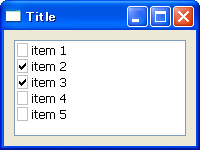
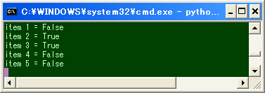

チェックボックス付きのリストボックスを作成する
----





`wx.CheckListBox` は、各項目にチェックボックスの付いたリストボックスを提供します。
コンストラクタのパラメータは、`wx.ListBox` と同様です。

```python
wx.CheckListBox#__init__(self, Window parent, int id=-1, Point pos=DefaultPosition,
    Size size=DefaultSize, wxArrayString choices=wxPyEmptyStringArray,
    long style=0, Validator validator=DefaultValidator,
    String name=ListBoxNameStr)
```

チェックボックスの状態が変更されたことを知るには、`wx.EVT_CHECKLISTBOX` イベントを処理します。

#### 実装例

```python
import wx

class MyFrame(wx.Frame):
    listItems = ['item 1', 'item 2', 'item 3', 'item 4', 'item 5']

    def __init__(self):
        wx.Frame.__init__(self, None, -1, "Title", size=(200,150))

        # Create widgets.
        panel = wx.Panel(self)
        clBox = wx.CheckListBox(panel, choices=self.listItems)
        clBox.Bind(wx.EVT_CHECKLISTBOX, self.OnSelect)

        # Set sizer.
        sizer = wx.BoxSizer(wx.HORIZONTAL)
        sizer.Add(clBox, 1, wx.EXPAND|wx.ALL, 10)
        panel.SetSizer(sizer)

    def OnSelect(self, event):
        clBox = event.GetEventObject()
        for i in range(0, clBox.GetCount()):
            print clBox.GetString(i), '=', clBox.IsChecked(i)

if __name__ == '__main__':
    app = wx.PySimpleApp()
    MyFrame().Show(True)
    app.MainLoop()
```

