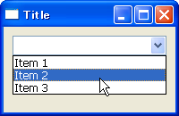
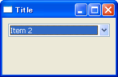
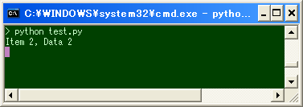

プルダウン・ボックスを作成する
----







`wx.Choice` は、プルダウン・ボックスを提供します。

```python
wx.Choice#__init__(Window parent, int id, Point pos=DefaultPosition, Size size=DefaultSize,
    List choices=EmptyList, long style=0, Validator validator=DefaultValidator,
    String name=ChoiceNameStr)
```

`wx.ListBox` と同じように、各項目に任意のオブジェクト (`clientData`) を関連付けることができます。
項目の選択状態が変更されたことを知りたい場合は、`wx.EVT_CHOICE` イベントを処理します。

#### 実装例

```python
import wx

class MyFrame(wx.Frame):
    def __init__(self):
        wx.Frame.__init__(self, None, -1, "Title", size=(200,130))

        # Create widgets.
        panel = wx.Panel(self)
        choice = wx.Choice(panel)
        choice.Append('Item 1', 'Data 1')
        choice.Append('Item 2', 'Data 2')
        choice.Append('Item 3', 'Data 3')
        choice.Bind(wx.EVT_CHOICE, self.OnChoice)

        # Set sizer.
        sizer = wx.BoxSizer(wx.HORIZONTAL)
        sizer.Add(choice, 1, wx.EXPAND|wx.ALL, 10)
        panel.SetSizer(sizer)

    def OnChoice(self, event):
        choice = event.GetEventObject()
        n = choice.GetSelection()
        print choice.GetString(n) + ', ' + choice.GetClientData(n)

if __name__ == '__main__':
    app = wx.PySimpleApp()
    MyFrame().Show(True)
    app.MainLoop()
```

