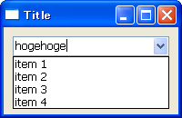

コンボ・ボックスを作成する
----




`wx.Coice` のサブクラスである `wx.ComboBox` は、テキスト入力領域と、プルダウンからの選択機能を備えたコンボ・ボックスを提供します。

```python
wx.ComboBox#__init__(Window parent, int id, String value=EmptyString,
    Point pos=DefaultPosition, Size size=DefaultSize,
    List choices=EmptyList, long style=0, Validator validator=DefaultValidator,
    String name=ComboBoxNameStr)
```

`wx.ComboBox` は、`wx.Choice` の機能と同時に、`wx.TextCtrl` の機能も備えています。
テキストフィールド内のテキストが変更されたことを知るには、`wx.TextCtrl` の場合と同様に、`wx.EVT_TEXT` イベントを処理します。

#### 実装例

```python
import wx

class MyFrame(wx.Frame):
    items = ['item 1', 'item 2', 'item 3', 'item 4']

    def __init__(self):
        wx.Frame.__init__(self, None, -1, "Title", size=(200,130))

        # Create widgets.
        panel = wx.Panel(self)
        combo = wx.ComboBox(panel, choices=self.items)
        combo.Bind(wx.EVT_TEXT, self.OnText)

        # Set sizer.
        sizer = wx.BoxSizer(wx.HORIZONTAL)
        sizer.Add(combo, 1, wx.EXPAND|wx.ALL, 10)
        panel.SetSizer(sizer)

    def OnText(self, event):
        combo = event.GetEventObject()
        print combo.GetValue()

if __name__ == '__main__':
    app = wx.PySimpleApp()
    MyFrame().Show(True)
    app.MainLoop()
```

