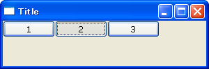
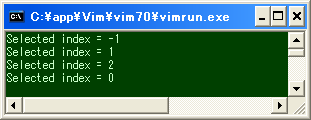

wxPython のイベントのハンドリング方法
----

wxPython アプリケーションの中で各種イベントが発生すると、そのイベントは適切な `wx.EvtHandler` オブジェクトに通知され、イベントタイプごとに設定されているイベントハンドラが呼び出されるようになっています。
wxPython のすべてのウィジェット (`wx.Window`) クラスは、実はこの `wx.EvtHandler` クラスのサブクラスとして定義されており、各種のイベント通知を受け取ることができるようになっています。
例えば、ボタンをクリックすると、対象となる `wx.Button` インスタンスに対して、`wx.EVT_BUTTON` という種類のイベントが通知されます。

~~~
ボタンをクリックする。
  │
  │(イベントタイプ: wx.EVT_BUTTON)
  ↓
wx.EvtHandler (この場合は wx.Button インスタンス) に通知される。
  │
  ↓
その wx.EvtHandler オブジェクトの wx.EVT_BUTTON バインダに関連付けられたハンドラ・メソッドを実行。
~~~

ある `wx.EvtHandler` オブジェクトに対して、特定の種類のイベントが通知されたときに任意のハンドラ・メソッドを実行するようにするには、`wx.EvtHandler` の `Bind()` メソッドによって、イベントの種類と呼び出されるハンドラ・メソッドを関連付けます。
例えば、`wx.Button` でボタンをクリックしたときに発生するイベント (`wx.EVT_BUTTON`) を、ユーザ定義の `OnButtonClick()` メソッドでハンドリングしたい場合は、次のようにハンドラ・メソッドをバインドします。

~~~ python
button.Bind(wx.EVT_BUTTON, self.OnButtonClick)
~~~

wx.EvtHandler#Bind() メソッドの詳細
----

`Bind` メソッドは下記のようなパラメータを取ります。

~~~ python
Bind(event, handler, source=None, id=wx.ID_ANY, id2=wx.ID_ANY)
~~~

event パラメータ
: ハンドリングするイベントの種類を表すイベントバインダを指定します。イベントバインダは、`wx.PyEventBinder` クラスのインスタンスです（例: `wx.EVT_BUTTON`）。

handler パラメータ
: イベントが発生した時に呼び出されるハンドラ・メソッドを指定します。`None` を指定すると、現在関連付けられているハンドラ・メソッドを解除します。ハンドラ・メソッドには慣習として `On＜イベント名＞` という形の名前が付けられます。

source パラメータ（デフォルト値 None）
: イベントの発生源を識別するためのウィジェットを指定します。

`Bind()` メソッドを呼び出した `wx.EvtHandler` インスタンス自身が、そのイベントの発生源である場合は、`source` パラメータを省略することができます。
例えば、複数のボタンを配置した `wx.Frame` の `__init__()` でボタンクリックのイベントを関連付けるには、以下のいずれかを実行します。

~~~ python
self.Bind(wx.EVT_BUTTON, self.OnButtonClick, button)
button.Bind(wx.EVT_BUTTON, self.OnButtonClick)
~~~

動作が異なってくるのは、`wx.Frame` に複数のボタンが配置されている状況で、次のように `source` パラメータを省略してボタンクリックのイベントを関連付けた場合です。

~~~ python
self.Bind(wx.EVT_BUTTON, self.OnButtonClick)
~~~

このようにすると、イベントの発生源を識別する（どのボタンが押されたかを示す）ためのボタンオブジェクトが関連付けられないので、どのボタンをクリックしても、`OnButtonClick()` が呼び出されるようになります。

id パラメータ、id2 パラメータ
: `id` で指定した ID が割り振られているウィジェットに対して、ハンドラ・メソッドを関連付けることができます。このパラメータを使用する場合は、`source` パラメータは使用しません。`id` と `id2` でウィジェットの ID の範囲を指定すると、複数のウィジェットに対して同一のハンドラ・メソッドを一度に関連付けることができます。

独自のイベントを持つウィジェットを作成する
----

以下のサンプルでは、3 つのトグルボタンを持つ独自のコントロール `ThreeButtonPanel` を作成します。
このトグルボタンは、ひとつのボタンしか ON 状態にすることができません。
ボタンの状態が変化したときは、独自イベントの `EVT_THREE_BUTTON` が発生し、ON 状態になっているボタンのインデックス（0～2）を取得できます。
どのボタンも OFF の状態の場合は、インデックスとして -1 を返すようにしています。

#### サンプルコード

~~~ python
import wx

class ThreeButtonEvent(wx.PyCommandEvent):
    def __init__(self, evtType, id):
        wx.PyCommandEvent.__init__(self, evtType, id)

    def SetSelectedIndex(self, index):
        self.index = index

    def GetSelectedIndex(self):
        return self.index

myEVT_THREE_BUTTON = wx.NewEventType()
EVT_THREE_BUTTON = wx.PyEventBinder(myEVT_THREE_BUTTON, 1)

class ThreeButtonPanel(wx.Panel):
    def __init__(self, parent, id=-1):
        wx.Panel.__init__(self, parent, id)
        # Create widgets.
        self.button1 = wx.ToggleButton(self, label='1')
        self.button2 = wx.ToggleButton(self, label='2')
        self.button3 = wx.ToggleButton(self, label='3')
        self.button1.index = 0
        self.button2.index = 1
        self.button3.index = 2
        # Set event handlers.
        self.Bind(wx.EVT_TOGGLEBUTTON, self.OnToggleButton)
        # Set sizer.
        sizer = wx.BoxSizer(wx.HORIZONTAL)
        sizer.Add(self.button1)
        sizer.Add(self.button2)
        sizer.Add(self.button3)
        self.SetSizer(sizer)

    def OnToggleButton(self, evt):
        button = evt.GetEventObject()
        index = button.index
        if button.GetValue():
            if button != self.button1:
                self.button1.SetValue(False)
            if button != self.button2:
                self.button2.SetValue(False)
            if button != self.button3:
                self.button3.SetValue(False)
        else:
            index = -1
        # Raise event.
        evt = ThreeButtonEvent(myEVT_THREE_BUTTON, self.GetId())
        evt.SetSelectedIndex(index)
        self.GetEventHandler().ProcessEvent(evt)

class MyFrame(wx.Frame):
    def __init__(self):
        wx.Frame.__init__(self, None, -1, "Title", size=(300,100))
        panel = ThreeButtonPanel(self)
        panel.Bind(EVT_THREE_BUTTON, self.OnThreeButton)

    def OnThreeButton(self, evt):
        print 'Selected index =', evt.GetSelectedIndex()

if __name__ == '__main__':
    app = wx.PySimpleApp()
    MyFrame().Show()
    app.MainLoop()
~~~

