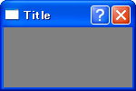

Frame に特殊スタイルを指定する
----



上のフレームは、特殊スタイルとして `wx.FRAME_EX_CONTEXTHELP` を設定し、「コンテキスト・ヘルプ」用のボタンを表示しています。

`wx.Frame` に特殊スタイルを指定する場合は、ネイティブな UI オブジェクトが生成される前、つまり、`Frame` インスタンスが生成される前に `SetExtraStyle()` を呼び出して設定する必要があります。
`Frame` インスタンスが作られていない状態で、その `SetExtraStyle()` メソッドを呼び出して特殊スタイルを設定するという一見矛盾した手順は、**two-step construction** と呼ばれる方法で実現されます。
簡単に言えば、`Frame` のコンストラクタ内で、特殊スタイル設定用の別の `Frame` オブジェクト（プリクラス）を作って、そのスタイルを自分自身に反映させます。

手順は、次のようになります。

1. `wx.Frame`（のサブクラス）のコンストラクタ (`__init__`) で `wx.PreFrame` インスタンスを生成する。
2. `wx.PreFrame#SetExtraStyle()` で特殊スタイルを設定する。
3. `wx.PreFrame#Create()` を実行。パラメータは `wx.Frame()` に渡すものと同様。
4. `wx.Frame#PostCreate()` で `wx.PreFrame` インスタンスを設定。このメソッドは `wxPython` 特有のもの。

#### 実装例

```python
import wx

class MyFrame(wx.Frame):
    def __init__(self):
        pre = wx.PreFrame()
        pre.SetExtraStyle(wx.FRAME_EX_CONTEXTHELP)
        pre.Create(None, -1, "Title", size=(150,100))
        self.PostCreate(pre)

if __name__ == '__main__':
    app = wx.PySimpleApp()
    MyFrame().Show(True)
    app.MainLoop()
```

`wx.PreFrame` は、`wx.Frame` 用のプリクラスであり、他の widget についても同様にプリクラスが用意されています。
例えば、`wx.Dialog` のプリクラスとして `wx.PreDialog` が用意されています。


Frame と Dialog の Close 処理の違い
----

`wx.Frame` や `wx.Dialog` の × ボタンを押したときや、`Close()` メソッドを明示的に呼び出した場合は、`wx.EVT_CLOSE` イベントが発生します。
このイベントをハンドリングしない場合（`Bind` しない場合）はデフォルトのハンドラが呼び出されますが、`wx.Frame` と `wx.Dialog` のデフォルトの処理内容は異なります。

- **wx.Frame の場合:** `EVT_CLOSE` イベントが発生すると、ウィンドウが非表示になり、内部で `Destroy()` メソッドが呼び出されてインスタンスが破棄される。
- **wx.Dialog の場合:** `EVT_CLOSE` イベントが発生すると、ウィンドウが非表示になる。`Destroy()` メソッドは呼び出されない。

`wx.Dialog` のデフォルトの `Close` 処理で `Destroy()` メソッドが呼び出されないのは、ダイアログを閉じた後で、そのダイアログに入力した値を読み取ることができるようにするためです。
ダイアログに入力された値を読み取り終わったら、明示的に `wx.Dialog#Destroy()` を呼び出す必要があります。

