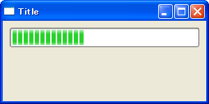

プログレス・バーを使用する
----



`wx.Gauge` はプログレス・バーを提供します。

```python
wx.Gauge#__init__(self, Window parent, int id=-1, int range=100, Point pos=DefaultPosition,
    Size size=DefaultSize, long style=GA_HORIZONTAL,
    Validator validator=DefaultValidator,
    String name=GaugeNameStr)
```

`style` パラメータでは、下記のようなスタイルを指定できます。

- `wx.GA_HORIZONTAL`, `wx.GA_VERTICAL` -- プログレス・バーの表示方向
- `wx.GA_PROGRESSBAR` -- Windows 専用のネイティブなプログレス・バーを表示

#### 実装例

```python
import wx

class MyFrame(wx.Frame):
    def __init__(self):
        wx.Frame.__init__(self, None, -1, "Title", size=(300, 150))
        panel = wx.Panel(self)
        self.gauge = wx.Gauge(panel, range=100, style=wx.GA_HORIZONTAL)
        self.Bind(wx.EVT_IDLE, self.OnIdle)

        # Set sizer.
        sizer = wx.BoxSizer(wx.VERTICAL)
        sizer.Add(self.gauge, 0, wx.EXPAND | wx.ALL, 10)
        panel.SetSizer(sizer)

    def OnIdle(self, event):
        count = self.gauge.GetValue() + 1
        if count > 100:
            count = 0
        self.gauge.SetValue(count)

if __name__ == '__main__':
    app = wx.PySimpleApp()
    MyFrame().Show(True)
    app.MainLoop()
```

