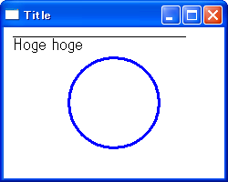

wx.Image と wx.Bitmap
----

wx.Image
: `wx.Image` はプラットフォーム非依存 (platform-independent) のイメージオブジェクトです。
画像ファイルの読み込み、保存などの機能を持っており、ピクセルデータとしてメモリ上に展開します。
どの形式の画像ファイルを読み込んでも、`wx.Image` オブジェクトとしてロードした時点で、抽象化された単純なピクセルデータとして扱えるようになります。
イメージオブジェクトに対して複雑な描画（線や円の描画）を行う場合は、通常は `wx.Bitmap` オブジェクトに変換してからデバイスコンテキスト (`wx.DC`) 経由で描画を行います。

wx.Bitmap
: `wx.Bitmap` はプラットフォーム依存 (platform-dependent) のイメージオブジェクトです。
イメージをディスプレイ上に描画したり、イメージ自体を編集したりするときに使用します。
これらの操作は、描画用の API をまとめたデバイスコンテキスト (`wx.DC`) 経由で行います。

wx.Image オブジェクトの生成方法いろいろ
----

### 画像ファイルから wx.Image オブジェクトを作成する

画像ファイルから `wx.Image` オブジェクトを作成するには、`wx.Image` のコンストラクタを使用します。

~~~ python
wx.Image(String name, long type=BITMAP_TYPE_ANY, int index=-1) -> Image
~~~

`name` パラメータでは、ロードする画像ファイルのパスを指定します。

`type` パラメータでは、画像ファイルを展開してピクセルデータに変換するためのイメージハンドラ (`wx.ImageHandler`) のタイプを指定します。
例えば、`wx.BITMAP_TYPE_PNG` を指定すると、`wx.PNGHandler` という PNG ファイルを展開するためのイメージハンドラが使用されます。
デフォルトの `BITMAP_TYPE_ANY` のままにしておけば、ファイルの内容に応じて適切なイメージハンドラを用いてロードしてくれるので、ほとんどの場合、このパラメータを指定する必要はありません。

`index` パラメータは、GIF や ICO、TIFF ファイルのように、ひとつの画像ファイルに複数のイメージを含んでいる場合に、どのイメージをロードするかを指定します（0-base 指定）。

#### 例: PNG イメージをロードする

~~~ python
image = wx.Image('sample.png')
~~~

`wx.Image` のコンストラクタとして、画像の MIME タイプ（`image/jpeg` など）をテキストで指定してロードするものも用意されています。

~~~ python
wx.ImageFromMime(String name, String mimetype, int index=-1) -> Image
~~~

### 空の wx.Image オブジェクトを作成する

~~~ python
wx.EmptyImage(int width=0, int height=0, bool clear=True) -> Image
~~~

指定したサイズの空のイメージを作成します。全てのピクセルは黒で初期化されます。

### テキストの RGB データから wx.Image オブジェクトを作成する

~~~ python
wx.ImageFromData(int width, int height, buffer data) -> Image
~~~

R,G,B の順で並んだ RGB データを元に `wx.Image` オブジェクトを作成します。
データのサイズは width x height x 3 である必要があります。

### wx.Bitmap から wx.Image オブジェクトを作成する

`wx.Bitmap` から `wx.Image` を作成するには、`wx.Image` のコンストラクタの `wx.ImageFromBitmap` を使用するか、`wx.Bitmap` のメソッド `ConvertToImage()` を使用します。

~~~ python
wx.ImageFromBitmap(Bitmap bitmap) -> Image
wx.Bitmap#ConvertToImage() -> Image
~~~

wx.Bitmap オブジェクトの生成方法いろいろ
----

### 画像ファイルから wx.Bitmap オブジェクトを作成する

~~~ python
wx.Bitmap(String name, int type=BITMAP_TYPE_ANY) -> Bitmap
~~~

パラメータは、`wx.Image` のコンストラクタと同様です。
内部で `wx.Image` を作成し、`wx.Bitmap` インスタンスが生成されます。

### 空の wx.Bitmap オブジェクトを作成する

~~~ python
wx.EmptyBitmap(int width, int height, int depth=-1) -> Bitmap
~~~

指定したサイズの空の `wx.Bitmap` オブジェクトを作成します。
`depth` パラメータでは、color depth（色のビット数）を指定することができます。
デフォルトの -1 を指定すると、現在のディスプレイの color depth が使用されます。
1 を指定すると、モノクロ画像になります。

### wx.Image から wx.Bitmap オブジェクトを作成する

`wx.Image` から `wx.Bitmap` を作成するには、`wx.Bitmap` のコンストラクタの `wx.BitmapFromImage` を使用するか、`wx.Image` のメソッド `ConvertToBitmap()` を使用します。

~~~ python
wx.BitmapFromImage(Image image, int depth=-1) -> Bitmap
wx.Image#ConvertToBitmap(int depth=-1) -> Bitmap
~~~

wx.Image でできること
----

### イメージのサイズを取得する

~~~ python
wx.Iamge#GetWidth() -> int
wx.Image#GetHeight() -> int
wx.Iamge#GetSize() -> Size
~~~

### 指定した座標のピクセルの RGB 値を得る

~~~ python
wx.Image#GetRed(int x, int y) -> byte
wx.Image#GetGreen(int x, int y) -> byte
wx.Image#GetBlue(int x, int y) -> byte
~~~

これらのメソッドは 0 ～ 255 の範囲で Red, Green, Blue の値を取得します。

### 指定した座標のピクセルの RGB 値を設定する

~~~ python
wx.Image#SetRGB(int x, int y, byte r, byte g, byte b)
~~~

`r`, `g`, `b` パラメータには 0 ～ 255 の範囲で Red, Green, Blue の値を取得します。

### すべてのピクセルデータを取得、設定する

多くのピクセル値を操作する場合、すべてのピクセルに対して `wx.Image#GetRed()` や、`SetRGB()` メソッドを呼び出すと処理に時間がかかります。
そのような場合は、`GetData()` メソッドですべてのピクセルデータを取得し、そのデータを編集後に `SetData()` メソッドで書き戻します。

~~~ python
wx.Image#GetData() -> PyObject
wx.Image#SetData(buffer data)
~~~

`SetData()` メソッドでは、`wx.ImageFromData()` と同様に、R,G,B の順で並んだ RGB データをセットします。
データのサイズは width x height x 3 である必要があります。

デバイス・コンテキスト (wx.DC) とは
----

wxPython では、色々な形式のイメージや、デバイスに対して共通の API で描画処理を行えるようにするために、デバイス・コンテキストのコンセプトが用いられています (`wx.DC`)。

### wx.DC のサブクラス

実際に描画処理を行う場合は、以下のような `wx.DC` のサブクラスを用途によって使い分けます。
`wx.DC` インスタンスは、ローカル変数として使用することを前提に設計されているため、グローバル変数やメンバ変数として保持してはいけません。

- Screen-based device contexts
  - `wx.ClientDC`（widget のクライアント領域への描画用）
  - `wx.WindowDC`（widget の全体領域への描画用）
  - `wx.ScreenDC`（デスクトップ全体への描画用）
  - `wx.PaintDC`（EVT_PAINT イベント内での描画用（クライアント領域への描画））
- Non-screen device contexts
  - `wx.MemoryDC`（Bitmap オブジェクトへの描画用）
  - `wx.MetaFileDC`（Windows metafile 作成用）
  - `wx.PostscriptDC`（Encapsulated PostScript file (.eps) 作成用）
  - `wx.PrinterDC`（プリンタ出力用 (for Windows)）
- Buffered device contexts
  - `wx.BufferedDC`（複数の描画処理をまとめて実行するアダプタ）
  - `wx.BufferedPaintDC`（複数の描画処理をまとめて実行するアダプタ（wx.PaintDC 用））

### wx.ClientDC

`wx.ClientDC` は、ウィジェット (`wx.Window`) のクライアント領域へ描画を行うためのデバイス・コンテキストです。
コンストラクタで、描画先の `wx.Window` オブジェクトを指定します。

~~~ python
wx.ClientDC(Window win) -> ClientDC
~~~

`wx.Frame` オブジェクトを指定した場合、タイトルバー、ツールバー、ボーダーなどはクライアント領域に含まれません。

### wx.WindowDC

`wx.WindowDC` は `wx.ClientDC` に似ていますが、対象となるウィジェット (`wx.Window`) の領域全体に描画を行うことができるデバイス・コンテキストです。
そのため、`wx.Frame` オブジェクトを指定した場合は、タイトルバー、ツールバー、ボーダー領域など `wx.Frame` の領域すべてが描画対象となります。

~~~ python
wx.WindowDC(Window win) -> WindowDC
~~~

### wx.ScreenDC

ディスプレイ全体（デスクトップ）に対して描画処理を行いたい場合は、デバイス・コンテキストとして  `wx.ScreenDC ` を使用します。

~~~ python
wx.ScreenDC() -> ScreenDC
~~~

### wx.PaintDC

クライアント領域の再描画タイミングで発生する ''EVT_PAINT'' イベントのハンドラの中では、`wx.ClientDC` の代わりに、`wx.PaintDC` インスタンスを生成する必要があります。
ここで `wx.PaintDC` を使用しなければいけないのは、`wx.PaintDC` が `EVT_PAINT` イベント発生時に、再描画領域を考慮した最適な描画処理を行うようになっているからです。

~~~ python
wx.PaintDC(Window win) -> PaintDC
~~~

### wx.MemoryDC

`wx.MemoryDC` はメモリ上に確保した `wx.Bitmap` オブジェクトに対して描画を行うためのデバイス・コンテキストです。

~~~ python
wx.MemoryDC(Bitmap bitmap=NullBitmap) -> MemoryDC
~~~

`wx.MemoryDC` を用いて描画を行う前に、必ず描画先の `wx.Bitmap` オブジェクトをセットしておく必要があります。
`wx.Bitmap` オブジェクトは、コンストラクタか、`SetObject()` メソッドでセットできます。

~~~ python
wx.MemoryDC#SelectObject(Bitmap bitmap)
~~~

編集された `wx.Bitmap` オブジェクトは、`wx.DC#DrawBitmap()` メソッドで別のデバイス・コンテキストへ描画したり、`wx.Bitmap#SaveFile()` メソッドで画像ファイルとして保存したりすることができます。

### wx.MetaFileDC

`wx.MetaFileDC` は、Microsoft Windows の `MetaFile` を作成するためのデバイス・コンテキストです。

~~~ python
wx.MetaFileDC(String filename=EmptyString, int width=0, int height=0,
    String description=EmptyString) -> MetaFileDC
~~~

描画後に `Close()` メソッドを呼び出すと、描画結果の `wx.Metafile` オブジェクトを取得することができ、その `SetClipboard()` メソッドを使って描画内容をクリップボードにコピーする、といったことができます。

~~~ python
wx.MetaFileDC#Close(self) -> MetaFile
wx.MetaFile#SetClipboard(int width=0, int height=0) -> bool
~~~

### wx.PostScriptDC

`wx.PostScriptDC` は、Encapsulated PostScript ファイル (.eps) を作成するためのデバイス・コンテキストです。

~~~ python
wx.PostScriptDC(wx.PrintData printData) -> PostScriptDC
~~~

### wx.PrinterDC

`wx.PrinterDC` を使用すると、Windows のプリンタ・ドライバに対して描画処理を行うことができます。

~~~ python
wx.PrinterDC(wx.PrintData printData) -> PrinterDC
~~~

### wx.BufferedDC, wx.BufferedPaintDC

`wx.BufferedDC` は、あるデバイス・コンテキストへの描画処理をバッファリングし、一度に描画内容を反映するようにします。
例えば、`wx.ClientDC` への連続した描画を `wx.BufferedDC` でバッファリングすれば、画面上での描画のちらつきを防ぐことができます。

~~~ python
wx.BufferedDC(DC dc, Bitmap buffer=NullBitmap, int style=BUFFER_CLIENT_AREA) -> BufferedDC
wx.BufferedDC(DC dc, Size area, int style=BUFFER_CLIENT_AREA) -> BufferedDC
~~~

`EVT_PAINT` イベントのハンドラの中で描画処理をバッファリングしたい場合は、`wx.BufferedDC` の代わりに `wx.BufferedPaintDC` を使用します。

~~~ python
wx.BufferedPaintDC(Window window, Bitmap buffer=NullBitmap, int style=BUFFER_CLIENT_AREA) -> BufferedPaintDC
~~~

`wx.BufferedDC`、`wx.BufferedPaintDC` は内部に描画内容のバッファリングのために `Bitmap` オブジェクトを保持しており、デバイス・コンテキストがスコープを外れるとき（ガーベジ・コレクトされるとき）に自動的に内部の `Bitmap` の内容を `Blit()` して実際の描画内容を反映するようになっています。

デバイス・コンテキストの使用例
----

### 再描画処理を考慮したグラフィック描画

以下のコードは、描画用バッファとして空の `wx.Bitmap` を作成し、適切なタイミングで（`EVT_PAINT` イベント発生時に）その描画内容を画面に反映させるサンプルです。
このような構成にすることで、ウィンドウの一部が他のウィンドウで隠れて再び表示された時に、必要な部分だけを再描画してくれます。
さらに、多くの描画処理を行った場合のちらつきもなくなります。
ウィンドウのサイズが変化した場合は、内部の描画用バッファ (`wx.Bitmap`) を新しいサイズで作成し直しています。

~~~ python
import wx

class MyFrame(wx.Frame):
    def __init__(self):
        wx.Frame.__init__(self, None, -1, "Title", size=(250,200))
        self.InitBuffer()
        # Bind events to redraw.
        self.Bind(wx.EVT_PAINT, self.OnPaint)
        self.Bind(wx.EVT_SIZE, self.OnSize)

    def OnPaint(self, evt):
        dc = wx.BufferedPaintDC(self, self.buffer)

    def OnSize(self, evt):
        self.InitBuffer()

    def InitBuffer(self):
        w, h = self.GetClientSize()
        self.buffer = wx.EmptyBitmap(w, h)
        self.DrawToBuffer()

    def DrawToBuffer(self):
        # Create buffered device context.
        dc = wx.BufferedDC(wx.ClientDC(self), self.buffer)
        # Clear the buffer.
        dc.SetBackground(wx.Brush('white'))
        dc.Clear()
        # Draw graphics.
        dc.DrawText('Hoge hoge', 10, 10)
        dc.DrawLine(10, 10, 200, 10)
        dw, dh = dc.GetSize()
        dc.SetPen(wx.Pen('blue', 3))
        dc.DrawCircle(dw/2, dh/2, 50)

if __name__ == '__main__':
    app = wx.PySimpleApp()
    MyFrame().Show()
    app.MainLoop()
~~~

### 再描画処理用のコードをライブラリ化する

以下のコードは、上記のコードの描画用バッファを確保する部分を汎用的な `PaintBuffer` クラスとしてライブラリ化したものです。
`PaintBuffer` クラスは、任意の `wx.Window` オブジェクト用の描画用バッファを作成します。

#### paintBuffer.py

~~~ python
import wx

class PaintBuffer:
    def __init__(self, window, paintHandler=None):
        self.window = window
        self.paintHandler = paintHandler
        # Create drawing buffer.
        self.InitBuffer()
        # Bind events to redraw.
        self.window.Bind(wx.EVT_PAINT, self.OnPaint)
        self.window.Bind(wx.EVT_SIZE, self.OnSize)

    def SetPaintHandler(handler):
        self.paintHandler = handler

    def OnPaint(self, evt):
        dc = wx.BufferedPaintDC(self.window, self.buffer)

    def OnSize(self, evt):
        self.InitBuffer()

    def InitBuffer(self):
        w, h = self.window.GetClientSize()
        self.buffer = wx.EmptyBitmap(w, h)
        self.DrawToBuffer()

    def DrawToBuffer(self):
        if self.paintHandler:
            dc = wx.BufferedDC(wx.ClientDC(self.window), self.buffer)
            self.paintHandler(dc)
~~~

#### test.py

~~~ python
import wx
import paintBuffer

class MyFrame(wx.Frame):
    def __init__(self):
        wx.Frame.__init__(self, None, -1, "Title", size=(250,200))
        self.buffer = paintBuffer.PaintBuffer(self, self.PaintHandler)

    def PaintHandler(self, dc):
        # Clear the buffer.
        dc.SetBackground(wx.Brush('white'))
        dc.Clear()
        # Draw graphics.
        dw, dh = dc.GetSize()
        dc.SetPen(wx.Pen('blue', 3))
        dc.DrawCircle(dw/2, dh/2, 50)

if __name__ == '__main__':
    app = wx.PySimpleApp()
    MyFrame().Show()
    app.MainLoop()
~~~

### Encapsulated PostScript ファイル (.eps) を作成するサンプルコード

~~~ python
import wx

if __name__ == '__main__':
    app = wx.PySimpleApp()

    data = wx.PrintData()
    data.SetFilename('test.eps')
    data.SetPaperId(wx.PAPER_LETTER)
    dc = wx.PostScriptDC(data)
    dc.StartDoc('')
    dc.DrawCircle(300, 300, 100)
    dc.EndDoc()
~~~

イメージ (wx.Bitmap) を描画する
----

`wx.Bitmap` をデバイス・コンテキストで描画するには、`wx.DC` の以下のメソッドを使用します（`wx.Icon` も同様のメソッドで描画できます）。

~~~ python
DrawBitmap(Bitmap bmp, int x, int y, bool useMask=False)
DrawIcon(Icon icon, int x, int y)
~~~

#### サンプルコード

~~~ python
import wx

class MyFrame(wx.Frame):
    def __init__(self):
        wx.Frame.__init__(self, None, -1, "Title", size=(150,100))
        # Load bitmap.
        self.bitmap = wx.Bitmap('sample.png')
        # Bind events.
        self.Bind(wx.EVT_PAINT, self.OnPaint)

    def OnPaint(self, evt):
        dc = wx.PaintDC(self)
        # Clear the buffer.
        dc.SetBackground(wx.Brush('sky blue'))
        dc.Clear()
        # Draw graphics.
        dc.DrawBitmap(self.bitmap, 10, 10)

if __name__ == '__main__':
    app = wx.PySimpleApp()
    MyFrame().Show()
    app.MainLoop()
~~~

