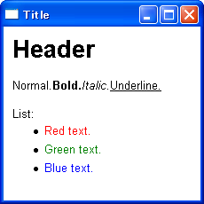
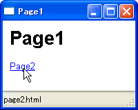
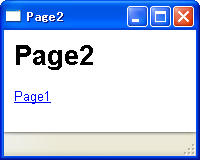

wx.html.HtmlWindow の基本
----



`wx.html.HtmlWindow widget` を配置すると、簡単な HTML をレンダリングすることができます。

```python
wx.html.HtmlWindow(Window parent, int id=-1, Point pos=DefaultPosition,
    Size size=DefaultSize, int style=HW_DEFAULT_STYLE,
    String name=HtmlWindowNameStr) -> HtmlWindow
```

ウィンドウに HTML の内容を描画するには、次のメソッドを使用します。

```python
- `HtmlWindow#SetPage(String source)`        # HTML 形式のテキストを指定
- `HtmlWindow#AppendToPage(String source)`   # HTML 形式のテキストを追加
- `HtmlWindow#LoadFile(String filename)`     # ファイルをロード
- `HtmlWindow#LoadPage(String location)`     # URL を指定してロード
```

以下のサンプルでは、`wx.Frame` の最上位に `wx.html.HtmlWindow` を配置しています。

```python
import wx
import wx.html

class MyFrame(wx.Frame):
    def __init__(self):
        wx.Frame.__init__(self, None, -1, "Title", size=(230,230))
        self.InitializeComponents()

    def InitializeComponents(self):
        html = wx.html.HtmlWindow(self)
        html.SetPage(
            '<H1>Header</H1>'
            'Normal.'
            '<B>Bold.</B>'
            '<I>Italic.</I>'
            '<U>Underline.</U>'
            '<BR><BR>List:'
            '<UL>'
            '<LI><FONT color="red">Red text.</FONT>'
            '<LI><FONT color="green">Green text.</FONT>'
            '<LI><FONT color="blue">Blue text.</FONT>'
            '</UL>')

if __name__ == '__main__':
    app = wx.PySimpleApp()
    MyFrame().Show(True)
    app.MainLoop()
```


wx.html.HtmlWindow の特徴
----

- CSS: cascading style sheets はサポートしません。
- JavaScript はサポートしません。
- 画像ファイルの URL を指定して表示することが可能です（`MIME type: image/*`）。
内部で `wx.Image` を使用しているので、`wx.Image` がサポートするファイルフォーマットの画像はすべて表示できます。


wx.html.HtmlWindow 上のリンクをクリックしたときのイベントを処理する
----

`wx.html.HtmlWindow` 上でのユーザ入力を処理したい場合は、`HtmlWindow` のサブクラスを作成し、`OnLinkClicked(link)` などのハンドラメソッドをオーバライドします。

```python
HtmlWindow#OnLinkClicked(HtmlLinkInfo link)
```

ユーザがリンクをクリックすると、`OnLinkClicked(link)` が呼び出されます。
引数で渡される `HtmlLinkInfo` オブジェクトを使って、アンカー要素 (HTML の a 要素）の `href` 属性の値を取得することができます。

```python
def OnLinkClicked(link):
    print link.GetHref()
```

`OnLinkClicked()` をオーバライドしない場合（デフォルトでは）、内部で `LoadPage()` が呼び出されます。


wx.Frame のタイトルバーにページタイトルを表示し、リンクのジャンプ先をステータスバーに表示する。
----






### タイトルバーをページタイトルと関連付ける

`wx.Frame` のタイトルバーに HTML のページタイトルを関連付けるには、`HtmlWindow#SetRelatedFrame()` を実行します。

```python
HtmlWindow#SetRelatedFrame(Frame frame, String format)
```

`frame` には関連付ける `Frame` オブジェクトを指定し、`format` にはタイトルバーに表示するテキストのフォーマットを指定します。
フォーマット内で `%s` というテキストを指定すると、HTML ページのタイトル（TITLE タグの値）に置き換えられてタイトルバーに表示されます。

ステータスバーを表示するには `Frame#CreateStatusBar()` を実行します。


### ステータスバーをリンクと関連付ける

マウスカーソルでリンクをポイントしたときに、リンク先の URL などをステータスバーに表示するようにするには、`HtmlWindow#SetRelatedFrame()` の後に、`HtmlWindow#SetRelatedStatusBar()` を実行します。

```python
HtmlWindow#SetRelatedStatusBar(int bar)
```

`bar` には、ステータスバーのスロット番号を指定します。
サンプルのようにステータスバーのスロットが 1 つだけの場合は、0 を指定すれば OK です。

`bar` に `-1` を指定すると、関連付けを解除することができます。


#### サンプルコード (page1.html)

```html
<TITLE>Page1</TITLE>
<H1>Page1</H1>
<A href="page2.html">Page2</A>
```

#### サンプルコード (page2.html)

```html
<TITLE>Page2</TITLE>
<H1>Page2</H1>
<A href="page1.html">Page1</A>
```

#### main.py

```python
import wx
import wx.html

class MyFrame(wx.Frame):
    def __init__(self):
        wx.Frame.__init__(self, None, size=(200,160))
        self.InitializeComponents()

    def InitializeComponents(self):
        # Show status bar.
        self.CreateStatusBar()
        # Create HtmlWindow.
        html = wx.html.HtmlWindow(self)
        html.SetRelatedFrame(self, '%s')
        html.SetRelatedStatusBar(0)
        html.LoadPage('page1.html')

if __name__ == '__main__':
    app = wx.PySimpleApp()
    MyFrame().Show(True)
    app.MainLoop()
```

