最上位 Panel の作成
----

`wx.Frame` の最上位に widget をひとつだけ配置すると、その widget はクライアント領域全体に広がります。
次の例では、`wx.Panel` をひとつだけ配置しています。

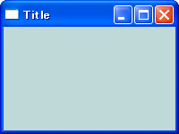

```python
import wx

class MyFrame(wx.Frame):
    def __init__(self):
        wx.Frame.__init__(self, None, -1, "Title", size=(200,150))
        self.InitializeComponents()

    def InitializeComponents(self):
        panel = wx.Panel(self)
        panel.SetBackgroundColour("LIGHT BLUE")

if __name__ == '__main__':
    app = wx.PySimpleApp()
    MyFrame().Show(True)
    app.MainLoop()
```


複数の widget を配置する
----

`wx.Frame` の直下に複数の widget を配置する場合や、`wx.Panel` の下に widget を配置する場合は、その位置／サイズを指定する必要があります（`Sizer` を使って widget を管理する場合は位置／サイズの指定をする必要はありません）。

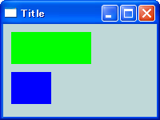

```python
import wx

class MyFrame(wx.Frame):
    def __init__(self):
        wx.Frame.__init__(self, None, -1, "Title", size=(200,150))
        self.InitializeComponents()

    def InitializeComponents(self):
        mainPanel = wx.Panel(self)
        mainPanel.SetBackgroundColour("LIGHT BLUE")
        panel1 = wx.Panel(mainPanel, pos=(10,10), size=(100,40))
        panel1.SetBackgroundColour("GREEN")
        panel2 = wx.Panel(mainPanel, pos=(10,60), size=(50,40))
        panel2.SetBackgroundColour("BLUE")

if __name__ == '__main__':
    app = wx.PySimpleApp()
    MyFrame().Show(True)
    app.MainLoop()
```


wx.BoxSizer
----

### wx.BoxSizer を使って widget を横方向、縦方向に並べる

`wx.BoxSizer` で widget を管理すると、横方向、あるいは縦方向に widget を並べられます（縦か横どちらか一方向だけです）。
`Sizer` で widget を管理する場合は、各 widget の位置、サイズを指定して作成する必要はありません。

縦横どちらの方向に並べるかは、`wx.BoxSizer` のコンストラクタで指定します。

- `sizer = wx.BoxSizer(wx.HORIZONTAL)` --- 横方向に並べる
- `sizer = wx.BoxSizer(wx.VERTICAL)` --- 縦方向に並べる

| 横方向 | 縦方向 |
| ------ | ------ |
| 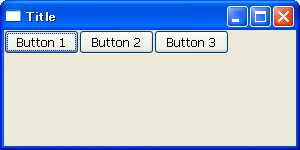 | 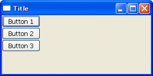 |

```python
import wx

class MyFrame(wx.Frame):
    def __init__(self):
        wx.Frame.__init__(self, None, -1, "Title", size=(300,150))
        self.InitializeComponents()

    def InitializeComponents(self):
        mainPanel = wx.Panel(self)
        button1 = wx.Button(mainPanel, -1, "Button 1")
        button2 = wx.Button(mainPanel, -1, "Button 2")
        button3 = wx.Button(mainPanel, -1, "Button 3")

        # Create a sizer.
        sizer = wx.BoxSizer(wx.HORIZONTAL)
        sizer.Add(button1)
        sizer.Add(button2)
        sizer.Add(button3)
        mainPanel.SetSizer(sizer)

if __name__ == '__main__':
    app = wx.PySimpleApp()
    MyFrame().Show(True)
    app.MainLoop()
```

### wx.BoxSizer で並べた方向に widget を伸ばす

`wx.BoxSizer#Add()` で widget を追加するするときに、第 2 引数 (`proportion`) で、サイズの割合を指定すると、ウィンドウ全体にフィットするように各 widget を伸ばして表示できます。
`propotion` パラメータに 0 （デフォルト値）を指定すると、ウィンドウサイズを変えても widget サイズは変化しません。

次の例では、3 つのボタンを **1:1:2 の割合**のサイズで横方向に並べています。
ウィンドウサイズを変えてもこの割合は保持されます。

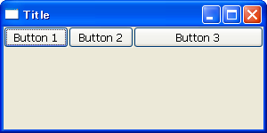
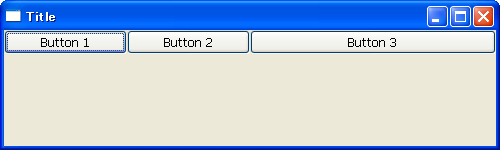

```python
# Create a sizer.
sizer = wx.BoxSizer(wx.HORIZONTAL)
sizer.Add(button1, 1)
sizer.Add(button2, 1)
sizer.Add(button3, 2)
mainPanel.SetSizer(sizer)
```

### wx.BoxSizer で並べた方向に垂直方向に widget を伸ばす

`wx.BoxSizer#Add()` で widget を追加するときに、第 3 引数 (`flag`) に `wx.EXPAND` を指定すると、並べた方向に垂直な方向に widget を伸ばして表示できます。

次の例では、1 つ目のボタンと 2 つ目のボタンを、`wx.BosSizer` で並べた方向と垂直な方向に伸ばして表示しています。


```python
# Create a sizer.
sizer = wx.BoxSizer(wx.HORIZONTAL)
sizer.Add(button1, 1, wx.EXPAND)
sizer.Add(button2, 1, wx.EXPAND)
sizer.Add(button3, 1)
mainPanel.SetSizer(sizer)
```

### wx.BoxSizer で並べた方向に垂直方向の位置指定

`wx.BoxSizer#Add()`の第 3 引数 (`flag`) に `wx.ALIGN_***` を指定すると、並べた方向に垂直な方向のどこに配置するかを決められます。
同時に `wx.EXPAND` を指定すると、この位置指定は意味がなくなります。

次の例では、3 つのボタンをそれぞれ上、中央、下に配置しています。

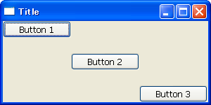

```python
# Create a sizer.
sizer = wx.BoxSizer(wx.HORIZONTAL)
sizer.Add(button1, 1, wx.ALIGN_TOP)
sizer.Add(button2, 1, wx.ALIGN_CENTER)
sizer.Add(button3, 1, wx.ALIGN_BOTTOM)
mainPanel.SetSizer(sizer)
```

### wx.BoxSizer で並べた widget 間の余白 (border) サイズを指定する

`wx.BoxSizer#Add()` の第 3 引数 (`flag`) で余白を入れる位置を指定し、さらに第 4 引数 `border` で余白サイズを指定すると、追加する widget の上下左右に余白を入れることができます。

#### flag に指定できる余白位置

- `wx.TOP`
- `wx.BOTTOM`
- `wx.LEFT`
- `wx.RIGHT`
- `wx.ALL`

次の例では、2 つ目のボタンの上下左右に 10 px の余白、3 つ目のボタンの右と下に 10 px の余白を設定しています。

![./image/20070316-boxsizer_margin.png]

```python
# Create a sizer.
sizer = wx.BoxSizer(wx.HORIZONTAL)
sizer.Add(button1, 1, wx.EXPAND)
sizer.Add(button2, 1, wx.EXPAND | wx.ALL, 10)
sizer.Add(button3, 1, wx.ALIGN_BOTTOM | wx.BOTTOM | wx.RIGHT, 10)
mainPanel.SetSizer(sizer)
```


wx.GridSizer
----

### wx.GridSizer で widget を格子状に並べる

`wx.GridSizer` を使って widget を管理すると、2 次元の格子状に widget を並べられます。
`wx.GridSizer` の各グリッドはすべて同じサイズになります。
`wx.GridSizer` のコンストラクタで、縦方向、横方向のアイテム数を指定します。

```python
sizer = wx.GridSizer(行数, 列数)
```

次の例では、2 x 3 の `wx.GridSizer` を作成しています。

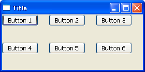

```python
import wx

class MyFrame(wx.Frame):
    def __init__(self):
        wx.Frame.__init__(self, None, -1, "Title", size=(300,150))
        self.InitializeComponents()

    def InitializeComponents(self):
        mainPanel = wx.Panel(self)
        button1 = wx.Button(mainPanel, -1, "Button 1")
        button2 = wx.Button(mainPanel, -1, "Button 2")
        button3 = wx.Button(mainPanel, -1, "Button 3")
        button4 = wx.Button(mainPanel, -1, "Button 4")
        button5 = wx.Button(mainPanel, -1, "Button 5")
        button6 = wx.Button(mainPanel, -1, "Button 6")

        # Create a sizer.
        sizer = wx.GridSizer(2, 3)
        sizer.Add(button1)
        sizer.Add(button2)
        sizer.Add(button3)
        sizer.Add(button4)
        sizer.Add(button5)
        sizer.Add(button6)
        mainPanel.SetSizer(sizer)

if __name__ == '__main__':
    app = wx.PySimpleApp()
    MyFrame().Show(True)
    app.MainLoop()
```

### wx.GridSizer で並べた widget の位置を指定する

`wx.GridSizer` に widget を追加するとき、`flag` パラメータでグリッド内での配置場所などを指定することができます。

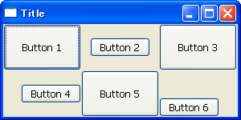

```python
# Create a sizer.
sizer = wx.GridSizer(2, 3)
sizer.Add(button1, flag=wx.EXPAND)
sizer.Add(button2, flag=wx.ALIGN_CENTER)
sizer.Add(button3, flag=wx.EXPAND)
sizer.Add(button4, flag=wx.ALIGN_RIGHT | wx.ALIGN_CENTER_VERTICAL)
sizer.Add(button5, flag=wx.EXPAND)
sizer.Add(button6, flag=wx.ALIGN_LEFT | wx.ALIGN_BOTTOM)
mainPanel.SetSizer(sizer)
```

### wx.GridSizer で並べた widget 間の余白を指定する

`wx.GridSizer` のコンストラクタの第 3 引数 (`vgap`)、第 4 引数 (`hgap`) を指定すると、各 widget 間の間隔を設定できます。

```python
sizer = wx.GridSizer(行数, 列数, 各行の間隔, 各列の間隔)
```

次の例では、各行の間隔を 5px、各列の間隔を 20px に設定しています。

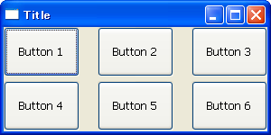

```python
# Create a sizer.
sizer = wx.GridSizer(2, 3, 5, 20)
sizer.Add(button1, flag=wx.EXPAND)
sizer.Add(button2, flag=wx.EXPAND)
sizer.Add(button3, flag=wx.EXPAND)
sizer.Add(button4, flag=wx.EXPAND)
sizer.Add(button5, flag=wx.EXPAND)
sizer.Add(button6, flag=wx.EXPAND)
mainPanel.SetSizer(sizer)
```


wx.FlexGridSizer
----

`wx.GridSizer` を拡張し、各行、各列のサイズの比率を変更できるようにしたのが `wx.FlexGridSizer` です。
`wx.FlexGridSizer` は `wx.GridSizer` のサブクラスであり、同様のパラメータでインスタンスを作成することができます。

```python
sizer = wx.FlexGridSizer(行数, 列数, [各行の間隔], [各列の間隔])
```

デフォルトでは、各 widget の最小サイズで格子状に並べられます。

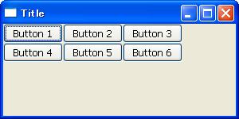

```python
import wx

class MyFrame(wx.Frame):
    def __init__(self):
        wx.Frame.__init__(self, None, -1, "Title", size=(300,150))
        self.InitializeComponents()

    def InitializeComponents(self):
        mainPanel = wx.Panel(self)
        button1 = wx.Button(mainPanel, -1, "Button 1")
        button2 = wx.Button(mainPanel, -1, "Button 2")
        button3 = wx.Button(mainPanel, -1, "Button 3")
        button4 = wx.Button(mainPanel, -1, "Button 4")
        button5 = wx.Button(mainPanel, -1, "Button 5")
        button6 = wx.Button(mainPanel, -1, "Button 6")

        # Create a sizer.
        sizer = wx.FlexGridSizer(2, 3)
        sizer.Add(button1, flag=wx.EXPAND)
        sizer.Add(button2, flag=wx.EXPAND)
        sizer.Add(button3, flag=wx.EXPAND)
        sizer.Add(button4, flag=wx.EXPAND)
        sizer.Add(button5, flag=wx.EXPAND)
        sizer.Add(button6, flag=wx.EXPAND)
        mainPanel.SetSizer(sizer)

if __name__ == '__main__':
    app = wx.PySimpleApp()
    MyFrame().Show(True)
    app.MainLoop()
```

### wx.FlexGridSizer で指定した行、列のサイズを広げる

指定した行、列のサイズをウィンドウにフィットするように伸ばすには、次の関数で対象の行、列のインデックスを指定します。

- `wx.FlexGridSizer#AddGrowableRow(行のインデックス)`
- `wx.FlexGridSizer#AddGrowableCol(列のインデックス)`

上記の設定を行わなかった行、列のサイズは、ウィンドウのサイズを変更しても変化しません。
次の例では、1 行目と、3 列目のサイズが広がるように指定しています。

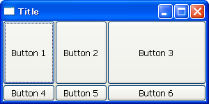
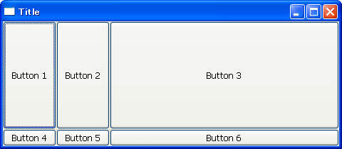

```python
# Create a sizer.
sizer = wx.FlexGridSizer(2, 3)
sizer.Add(button1, flag=wx.EXPAND)
sizer.Add(button2, flag=wx.EXPAND)
sizer.Add(button3, flag=wx.EXPAND)
sizer.Add(button4, flag=wx.EXPAND)
sizer.Add(button5, flag=wx.EXPAND)
sizer.Add(button6, flag=wx.EXPAND)
sizer.AddGrowableRow(0)
sizer.AddGrowableCol(2)
mainPanel.SetSizer(sizer)
```

### wx.FlexGridSizer で各行のサイズの比率を指定する

`wx.FlexGridSizer#AddGrowableRow()` の第 2 引数 (`proportion`) で各行のサイズの比率を指定することができます。
各列のサイズの比率も同様に指定できます。

- `wx.FlexGridSizer#AddGrowableRow(行のインデックス, その行のサイズの比率)`
- `wx.FlexGridSizer#AddGrowableCol(列のインデックス, その列のサイズの比率)`

次の例では、各行のサイズ比を 1:2、各列のサイズ比を 1:3:1 に設定しています。

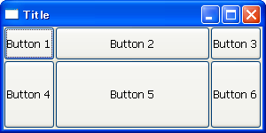
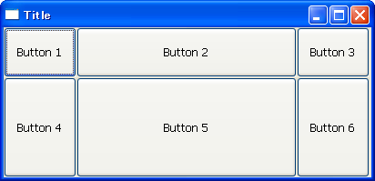

```python
# Create a sizer.
sizer = wx.FlexGridSizer(2, 3)
sizer.Add(button1, flag=wx.EXPAND)
sizer.Add(button2, flag=wx.EXPAND)
sizer.Add(button3, flag=wx.EXPAND)
sizer.Add(button4, flag=wx.EXPAND)
sizer.Add(button5, flag=wx.EXPAND)
sizer.Add(button6, flag=wx.EXPAND)
sizer.AddGrowableRow(0, 1)
sizer.AddGrowableRow(1, 2)
sizer.AddGrowableCol(0, 1)
sizer.AddGrowableCol(1, 3)
sizer.AddGrowableCol(2, 1)
mainPanel.SetSizer(sizer)
```


wx.GridBugSizer で複数行／列にまたがる widget を配置する
----

`wx.FlexGridSizer` を拡張し、ひとつの widget が複数の区画をまたがるように配置できるようにしたのが `wx.GridBugSizer` です。
`wx.GridBugSizer` では、`Add()` メソッドで widget を配置することで自動的に最終的なレイアウトを決定するので、コンストラクタではそのサイズを指定する必要はありません。

```python
sizer = wx.GridBugSizer([各行の間隔], [各列の間隔])
```

`wx.GridBugSizer#Add()` メソッドでは、追加する widget の他に、追加する位置 (`wx.GBPosition`)、サイズ (`wx.GBSpan`) を指定する必要があります。
2 つ以上の widget の位置が重なるとエラーになります。
例えば、`button1` の位置を (y,x)=(0,0)、サイズを 2 行 4 列にするのであれば、次のようにします。

```python
sizer.Add(button1, (0,0), (2,4))
```

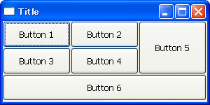
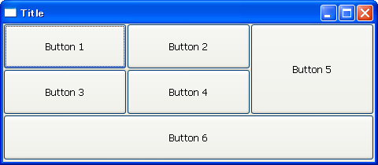

```python
import wx

class MyFrame(wx.Frame):
    def __init__(self):
        wx.Frame.__init__(self, None, -1, "Title", size=(300,150))
        self.InitializeComponents()

    def InitializeComponents(self):
        mainPanel = wx.Panel(self)
        button1 = wx.Button(mainPanel, -1, "Button 1")
        button2 = wx.Button(mainPanel, -1, "Button 2")
        button3 = wx.Button(mainPanel, -1, "Button 3")
        button4 = wx.Button(mainPanel, -1, "Button 4")
        button5 = wx.Button(mainPanel, -1, "Button 5")
        button6 = wx.Button(mainPanel, -1, "Button 6")

        # Create a sizer.
        sizer = wx.GridBagSizer()
        sizer.Add(button1, (0,0), (1,1), flag=wx.EXPAND)
        sizer.Add(button2, (0,1), (1,1), flag=wx.EXPAND)
        sizer.Add(button3, (1,0), (1,1), flag=wx.EXPAND)
        sizer.Add(button4, (1,1), (1,1), flag=wx.EXPAND)
        sizer.Add(button5, (0,2), (2,1), flag=wx.EXPAND)
        sizer.Add(button6, (2,0), (1,3), flag=wx.EXPAND)
        sizer.AddGrowableRow(0)
        sizer.AddGrowableRow(1)
        sizer.AddGrowableRow(2)
        sizer.AddGrowableCol(0)
        sizer.AddGrowableCol(1)
        sizer.AddGrowableCol(2)
        mainPanel.SetSizer(sizer)

if __name__ == '__main__':
    app = wx.PySimpleApp()
    MyFrame().Show(True)
    app.MainLoop()
```


メモ
----

### 複雑なレイアウトは単純な Sizer を組み合わせて作るべし

ひとつの `Sizer` だけでもある程度複雑なレイアウトの GUI を作成することができますが、widget が多くなってくるとコードが分かりにくくなってきます。
また、グリッドの区切り位置に柔軟性を持たせるためには、複数の `Sizer` を組み合わせることが必要です。

パーツごと（意味のあるまとまりごと）に、できるだけ単純な `Sizer` でレイアウトし、それらの `Sizer` を最後に `wx.GridBagSizer` などでまとめるといった工夫をするとコードが分かりやすくなります。

### wx.StaticBoxSizer

`wx.StaticBoxSizer` はダサい。
見た目がダサいのではなくて、これ使うとコードがダサダサになるので、`wx.StaticBoxSizer` のサンプルコードはとりあえず保留。

