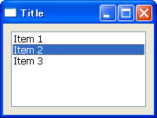
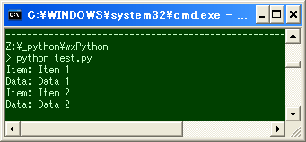
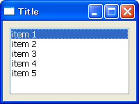
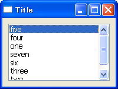

リストボックスを使う
---

`wx.ListBox` は選択候補を示すリストボックスを提供します。

~~~ python
wx.ListBox#__init__(self, Window parent, int id=-1, Point pos=DefaultPosition,
    Size size=DefaultSize, wxArrayString choices=wxPyEmptyStringArray,
    long style=0, Validator validator=DefaultValidator,
    String name=ListBoxNameStr)
~~~

リストボックスに項目を追加するには、`Append()` メソッドや `InsertItem()` メソッドを使用します。各項目には、任意のオブジェクト (`clientData`) を関連付けて、別の場所から参照することができます。

### 項目を追加するためのメソッド

`ListBox#Append(String item, PyObject clientData=None) -> int`
: 末尾へ項目を追加する。

`ListBox#Insert(self, String item, int pos, PyObject clientData=None)`
: 指定した位置に項目を挿入する。

項目の選択状態が変化したことを知るには、`wx.EVT_LISTBOX` イベントを処理します。項目をダブルクリックした倍は `wx.EVT_LISTBOX_DCLICK` イベントが発生します。

### 選択中の項目を取得するためのメソッド

`ListBox#GetSelection()`
: 選択されている項目のインデックスを取得する (0 base)。選択されていない場合は `wx.NOT_FOUND` を返す。

`ListBox#GetString(n)`
: 指定したインデックスの項目のラベルを取得する。

`ListBox#GetClientData(n)`
: 指定したインデックスの項目に関連付けられたクライアントデータを取得する。

~~~ python
import wx

class MyFrame(wx.Frame):
    def __init__(self):
        wx.Frame.__init__(self, None, -1, "Title", size=(200,150))

        # Create widgets.
        panel = wx.Panel(self)
        listBox = wx.ListBox(panel)
        listBox.Bind(wx.EVT_LISTBOX, self.OnSelect)

        # Append items, which have client data.
        listBox.Append("Item 1", "Data 1")
        listBox.Append("Item 2", "Data 2")
        listBox.Append("Item 3", "Data 3")

        # Set sizer.
        sizer = wx.BoxSizer(wx.HORIZONTAL)
        sizer.Add(listBox, 1, wx.EXPAND|wx.ALL, 10)
        panel.SetSizer(sizer)

    def OnSelect(self, event):
        listBox = event.GetEventObject()
        n = listBox.GetSelection()
        if n == wx.NOT_FOUND:
            return
        print 'Item: ' + listBox.GetString(n)
        print 'Data: ' + listBox.GetClientData(n)

if __name__ == '__main__':
    app = wx.PySimpleApp()
    MyFrame().Show(True)
    app.MainLoop()
~~~

文字列のリストからリストボックスの項目を作成する
----

`wx.ListBox` のコンストラクタの `choices` パラメータに、文字列のリストを指定すると、一度に複数の項目を追加することができます。

~~~ python
import wx

class MyFrame(wx.Frame):
    listItems = ['item 1', 'item 2', 'item 3', 'item 4', 'item 5']

    def __init__(self):
        wx.Frame.__init__(self, None, -1, "Title", size=(200,150))

        # Create widgets.
        panel = wx.Panel(self)
        listBox = wx.ListBox(panel, choices=self.listItems)

        # Set sizer.
        sizer = wx.BoxSizer(wx.HORIZONTAL)
        sizer.Add(listBox, 1, wx.EXPAND|wx.ALL, 10)
        panel.SetSizer(sizer)

if __name__ == '__main__':
    app = wx.PySimpleApp()
    MyFrame().Show(True)
    app.MainLoop()
~~~

以下のメソッドを使うことでも、複数の項目を追加することができます。

### 複数の項目を追加するためのメソッド

`ListBox#AppendItems(self, List strings)`
: 末尾に複数の項目を追加する。

`ListBox#InsertItems(self, wxArrayString items, unsigned int pos)`
: 指定した位置に複数の項目を挿入する。

リストボックス内の項目を自動的にソートする
----

`wx.ListBox` のコンストラクタの `style` パラメータに、`wx.LB_SORT` フラグを設定すると、リストボックス内の項目が自動的にソートされて表示されるようになります。

~~~ python
import wx

class MyFrame(wx.Frame):
    listItems = ['one', 'two', 'three', 'four', 'five', 'six', 'seven']

    def __init__(self):
        wx.Frame.__init__(self, None, -1, "Title", size=(200,150))

        # Create widgets.
        panel = wx.Panel(self)
        listBox = wx.ListBox(panel, choices=self.listItems, style=wx.LB_SORT)

        # Set sizer.
        sizer = wx.BoxSizer(wx.HORIZONTAL)
        sizer.Add(listBox, 1, wx.EXPAND|wx.ALL, 10)
        panel.SetSizer(sizer)

if __name__ == '__main__':
    app = wx.PySimpleApp()
    MyFrame().Show(True)
    app.MainLoop()
~~~

SetSelection(index) しても、EVT_LISTBOX イベントは発生しない
----

`wx.ListBox` の項目をマウスやキーボードで選択すると `EVT_LISTBOX` イベントが発生しますが、`wx.ListBox#SetSelection(index)` でプログラム内からリスト項目を選択した場合にはイベントが発生しません。
そのため、`SetSelection()` で選択項目を変更した場合は、`EVT_LISTBOX` イベント発生時と同様の処理を明示的に実行する必要があります。

以下の例では、`EVT_LISTBOX` イベント発生時の処理と、`ListBox#SetSelection()` 実行後の処理を `ShowContent()` という関数で共通化しています。

~~~ python
def __init__(self):
    ...
    self.listBox.Bind(wx.EVT_LISTBOX, self.OnSelect)
    ...

def OnSelect(self, event):
    self.ShowContent()

def SelectTopItem(self):
    self.listItem.SetSelection(0)
    self.ShowContent()

def ShowContent(self):
    ...
    n = self.listBox.GetSelection()
    if n == wx.NOT_FOUND:
        return
    data = self.listBox.GetClientData(n)
    ...
~~~

