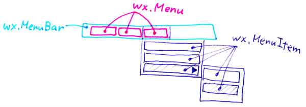
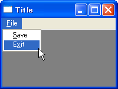

メニューバーの構成
----

メニューバー (`wx.MenuBar`) コンポーネントは、wxPython による GUI アプリケーションにメニュー機能を提供します。
メニューバーは、次のような入れ子構造になっています。

~~~
MenuBar ◇── Menu ◇── MenuItem
~~~

メニューバーの追加
----

### wx.MenuBar の作成と、wx.Frame へのセット

メニューバー (`wx.MenuBar`) は、`wx.Frame` の `__init__()` や `OnInit()` の中でインスタンス化し、`SetMenuBar()` メソッドでセットします。

~~~ python
menuBar = wx.MenuBar()
self.SetMenuBar(menuBar)
~~~

### wx.MenuBar に wx.Menu を追加する

メニューバーにトップレベルのメニュー (`wx.Menu`) を追加するには、まず `wx.Menu` のインスタンスを生成し、それを `wx.MenuBar` の `Append()` メソッドや `Insert()` メソッドで追加します。

- wx.MenuBar のメソッド
  - `Append(Menu menu, String title)`
  - `Insert(size_t pos, Menu menu, String title)`

~~~ python
menu = wx.Menu()
menuBar.Append(menu, '&File')
~~~

### wx.Menu に wx.MenuItem を追加する

`wx.Menu` に個々のメニュー項目を追加するには、`wx.Menu` の以下のメソッドを使用します。

- wx.Menu のメソッド
  - `Append(int id, String text=EmptyString, String help=EmptyString, int kind=ITEM_NORMAL)`
  - `Prepend(int id, String text=EmptyString, String help=EmptyString, int kind=ITEM_NORMAL)`
  - `Insert(size_t pos, int id, String text=EmptyString, String help=EmptyString, int kind=ITEM_NORMAL)`
  - `AppendSeparator()`
  - `PrependSeparator()`
  - `InsertSeparator(size_t pos)`

`help` パラメータにテキストを指定しておくと、ステータスバーにその内容を表示することができます。

~~~ python
save = menu.Append(-1, '&Save', 'Save file.')
exit = menu.Appedn(-1, 'E&xit', 'Terminate the application.')
save.Bind(wx.EVT_MENU, self.OnSave)
exit.Bind(wx.EVT_MENU, self.OnExit)
~~~

`Append` 系メソッドは末尾、`Prepend` 系メソッドは先頭、`Insert` 系メソッドは指定した位置にメニュー項目を追加します。
セパレータを追加するメソッドも用意されています。
これらのメソッドを呼び出すと、メニュー項目を表す `wx.MenuItem` が内部で生成され、戻り値として返されます。

`wx.MenuItem` を明示的にインスタンス化して、`wx.Menu` にセットすることもできます。

- wx.MenuItem のコンストラクタ
  - `wx.MenuItem(Menu parentMenu=None, int id=ID_SEPARATOR, String text=EmptyString, String help=EmptyString, int kind=ITEM_NORMAL, Menu subMenu=None)`

- wx.Menu のメソッド
  - `AppendItem(MenuItem item)`
  - `PrependItem(MenuItem item)`
  - `InsertItem(size_t pos, MenuItem item)`

#### サンプルコード

~~~ python
import wx

class MyFrame(wx.Frame):
    def __init__(self):
        wx.Frame.__init__(self, None, -1, 'Title', size=(200, 150))
        self.CreateMenuBar()

    def CreateMenuBar(self):
        # Create 'File' menu and its items.
        fileMenu = wx.Menu()
        save = fileMenu.Append(-1, '&Save')
        exit = fileMenu.Append(-1, 'E&xit')
        self.Bind(wx.EVT_MENU, self.OnSave, save)
        self.Bind(wx.EVT_MENU, self.OnExit, exit)

        # Create a menu bar.
        menuBar = wx.MenuBar()
        menuBar.Append(fileMenu, '&File')
        self.SetMenuBar(menuBar)

    def OnSave(self, event):
        wx.MessageBox('OnSave')

    def OnExit(self, event):
        self.Close()

if __name__ == '__main__':
    app = wx.PySimpleApp()
    MyFrame().Show()
    app.MainLoop()
~~~

