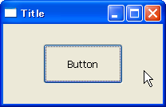
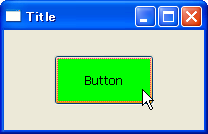

mouse enter イベントと mouse leave イベント
----

マウスカーソルがウィジェット (`wx.Window`) の領域に入ったとき、出たときは次のようなイベントが発生します。

wx.EVT_ENTER_WINDOW
: マウスカーソルがウィジェットの領域に入った。

wx.EVT_LEAVE_WINDOW
: マウスカーソルがウィジェットの領域から出た。

次の例では、マウスカーソルがボタンの上にきたときにボタンの背景色を変えています。

#### マウスカーソルがウィジェットの上にないとき

#### マウスカーソルがウィジェットの上にあるとき

#### サンプルコード

~~~ python
import wx

class MyFrame(wx.Frame):
    def __init__(self):
        wx.Frame.__init__(self, None, -1, "Title")
        self.SetClientSizeWH(200, 100)
        self.InitializeComponents()

    def InitializeComponents(self):
        mainPanel = wx.Panel(self)
        self.button = wx.Button(mainPanel, label="Button", pos=(50,25), size=(100,50))

        # Bind event handlers.
        self.button.Bind(wx.EVT_BUTTON, self.OnButtonClick)
        self.button.Bind(wx.EVT_ENTER_WINDOW, self.OnEnterWindow)
        self.button.Bind(wx.EVT_LEAVE_WINDOW, self.OnLeaveWindow)

    def OnButtonClick(self, event):
        print self.Close(True)

    def OnEnterWindow(self, event):
        # Store color of button
        self.prevColour = self.button.GetBackgroundColour()
        # Change color of button
        self.button.SetBackgroundColour("Green")

    def OnLeaveWindow(self, event):
        # Restore color of button
        self.button.SetBackgroundColour(self.prevColour)

if __name__ == '__main__':
    app = wx.PySimpleApp()
    MyFrame().Show(True)
    app.MainLoop()
~~~

ちなみに、`button.Disable()` としてボタンを無効にすると、そのボタンに対するイベントは生成されなくなります。

