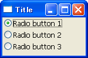
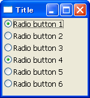
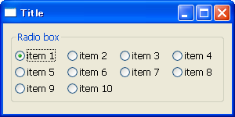

ラジオボタンを使用する
----

ラジオボタン (`wx.RadioButton`) を使用すると、選択肢の中からひとつの項目を選ぶようにユーザに促すことができます。

#### wx.RadioButton コンストラクタ

~~~ python
wx.RadioButton#__init__(self, Window parent, int id=-1, String label=EmptyString,
    Point pos=DefaultPosition, Size size=DefaultSize,
    long style=0, Validator validator=DefaultValidator,
    String name=RadioButtonNameStr)
~~~

ラジオボタンの選択状態が変化したことを知りたいときは、`wx.EVT_RADIOBUTTON` イベントを処理します。

#### サンプルコード

~~~ python
import wx

class MyFrame(wx.Frame):
    def __init__(self):
        wx.Frame.__init__(self, None, -1, "Title", size=(150, 100))
        panel = wx.Panel(self)
        radio1 = wx.RadioButton(panel, label='Radio button 1', style=wx.RB_GROUP)
        radio2 = wx.RadioButton(panel, label='Radio button 2')
        radio3 = wx.RadioButton(panel, label='Radio button 3', style=wx.RB_GROUP)
        self.Bind(wx.EVT_RADIOBUTTON, self.OnRadio)

        # Set sizer.
        sizer = wx.BoxSizer(wx.VERTICAL)
        sizer.Add(radio1, 0, wx.ALL, 3)
        sizer.Add(radio2, 0, wx.ALL, 3)
        sizer.Add(radio3, 0, wx.ALL, 3)
        panel.SetSizer(sizer)

    def OnRadio(self, event):
        selected = event.GetEventObject()
        print selected.GetLabel()

if __name__ == '__main__':
    app = wx.PySimpleApp()
    MyFrame().Show(True)
    app.MainLoop()
~~~

ラジオボタンのグループ管理
----

`wx.RadioButton` のコンストラクタの `style` パラメータで、`wx.RB_GROUP` フラグを設定すると、そのラジオボタンから新いグループに追加されます。
グループごとに 1 つの項目を選択できます。

~~~ python
radio1 = wx.RadioButton(panel, label='Radio button 1')
radio2 = wx.RadioButton(panel, label='Radio button 2')
radio3 = wx.RadioButton(panel, label='Radio button 3')
radio4 = wx.RadioButton(panel, label='Radio button 4', style=wx.RB_GROUP)
radio5 = wx.RadioButton(panel, label='Radio button 5')
radio6 = wx.RadioButton(panel, label='Radio button 6')
~~~

ただ、これだとどのようにグルーピングされているのかが分かりにくいため、このようなケースでは `wx.RadioButton` の代わりに `wx.RadioBox` を使用するとよいでしょう（後述）。

wx.RadioBox を使ってラジオボタンのグループを一度に作成する
----

`wx.RadioBox` を使うと、文字列のリストを使って 1 グループのラジオボタンを一度に作成することができます。

#### wx.RadioBox コンストラクタ

~~~ python
wx.RadioBox#__init__(self, Window parent, int id=-1, String label=EmptyString,
    Point pos=DefaultPosition, Size size=DefaultSize,
    wxArrayString choices=wxPyEmptyStringArray,
    int majorDimension=0, long style=RA_HORIZONTAL,
    Validator validator=DefaultValidator,
    String name=RadioBoxNameStr)
~~~

#### 指定可能なスタイル

- `wx.RA_SPECIFY_COLS` -- 列の数を majorDimension パラメータで指定します
- `wx.RA_SPECIFY_ROWS` -- 行の数を majorDimension パラメータで指定します

`wx.RadioBox` 内のアイテムの選択状態が変化したことを知りたい場合は、`wx.EVT_RADIOBOX` イベントを処理します。
次の例では、10 個のアイテム（item 1 ～ item 10）を、4 列で表示しています。

~~~ python
import wx

class MyFrame(wx.Frame):
    def __init__(self):
        wx.Frame.__init__(self, None, -1, "Title", size=(300, 150))
        panel = wx.Panel(self)
        itemList = ['item 1', 'item 2', 'item 3', 'item 4', 'item 5',
            'item 6', 'item 7', 'item 8', 'item 9', 'item 10']
        radio = wx.RadioBox(panel, label='Radio box', choices=itemList,
            majorDimension=4, style=wx.RA_SPECIFY_COLS)
        radio.Bind(wx.EVT_RADIOBOX, self.OnRadio)

        # Set sizer.
        sizer = wx.BoxSizer(wx.HORIZONTAL)
        sizer.Add(radio, 1, wx.ALL, 10)
        panel.SetSizer(sizer)

    def OnRadio(self, event):
        radioBox = event.GetEventObject()
        print radioBox.GetStringSelection()

if __name__ == '__main__':
    app = wx.PySimpleApp()
    MyFrame().Show(True)
    app.MainLoop()
~~~

