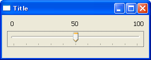
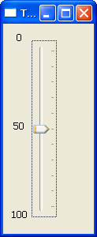

スライダーを使用する
----

`wx.Slider` は数値入力用のスライダーを提供します。

#### wx.Slider のコンストラクタ

~~~ python
wx.Slider#__init__(self, Window parent, int id=-1, int value=0, int minValue=0,
    int maxValue=100, Point pos=DefaultPosition,
    Size size=DefaultSize, long style=SL_HORIZONTAL,
    Validator validator=DefaultValidator,
    String name=SliderNameStr)
~~~

- 指定できるスタイル
  - `wx.HORIZONTAL` / `wx.VERTICAL` -- 表示方向
  - `wx.SL_AUTOTICKS` -- メモリの表示
  - `wx.SL_LABELS` -- メモリの最小値／最大値、現在の値をラベルで表示

#### サンプルコード

~~~ python
import wx

class MyFrame(wx.Frame):
    def __init__(self):
        wx.Frame.__init__(self, None, -1, "Title", size=(300, 120))
        panel = wx.Panel(self)
        slider = wx.Slider(panel, -1, 50, 0, 100,
            style=wx.SL_HORIZONTAL | wx.SL_AUTOTICKS | wx.SL_LABELS)
        slider.SetTickFreq(10)

        # Set sizer.
        sizer = wx.BoxSizer(wx.VERTICAL)
        sizer.Add(slider, 1, wx.EXPAND | wx.ALL, 10)
        panel.SetSizer(sizer)

if __name__ == '__main__':
    app = wx.PySimpleApp()
    MyFrame().Show(True)
    app.MainLoop()
~~~

