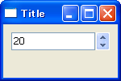

スピン・コントロールを使用する
----

`wx.SpinCtrl` コンポーネントは、は数値入力用のスピン・コントロールを提供します。

#### wx.SpinCtrl コンストラクタ

~~~ python
wx.SpinCtrl#__init__(self, Window parent, int id=-1, String value=EmptyString,
    Point pos=DefaultPosition, Size size=DefaultSize,
    long style=SP_ARROW_KEYS, int min=0, int max=100,
    int initial=0, String name=SpinCtrlNameStr)
~~~

#### 指定できるスタイル

- `wx.SP_ARROW_KEYS` (default) -- カーソル上下キーで、数値を変更可能にします。
- `wx.SP_WRAP` -- 上限値と下限値をシームレスに繋ぎます。

#### サンプルコード

~~~ python
import wx

class MyFrame(wx.Frame):
    def __init__(self):
        wx.Frame.__init__(self, None, -1, "Title", size=(150, 100))
        panel = wx.Panel(self)
        spin = wx.SpinCtrl(panel, min=0, max=100, style=wx.SP_ARROW_KEYS)
        spin.SetValue(20)

        # Set sizer.
        sizer = wx.BoxSizer(wx.VERTICAL)
        sizer.Add(spin, 0, wx.EXPAND | wx.ALL, 10)
        panel.SetSizer(sizer)

if __name__ == '__main__':
    app = wx.PySimpleApp()
    MyFrame().Show(True)
    app.MainLoop()
~~~

