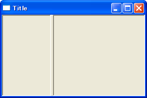

wx.SplitterWindow 上下、左右にウィンドウを分割する
----

#### wx.SplitterWindow コンストラクタ

~~~ python
wx.SplitterWindow(Window parent, int id=-1, Point pos=DefaultPosition,
    Size size=DefaultSize, long style=SP_3D, String name=SplitterNameStr) -> SplitterWindow
~~~

`wx.SplitterWindow` を配置すると、ウィンドウを上下、あるいは左右に分割することができます。
次の例では、`wx.Frame` を左右に分割し、それぞれに `wx.Panel` を配置しています。

#### サンプルコード（ウィンドウを左右に分割）

~~~ python
import wx

class MyFrame(wx.Frame):
    def __init__(self):
        wx.Frame.__init__(self, None, -1, "Title", size=(300,200))
        self.InitializeComponents()

    def InitializeComponents(self):
        sp = wx.SplitterWindow(self)
        p1 = wx.Panel(sp, style=wx.SUNKEN_BORDER)
        p2 = wx.Panel(sp, style=wx.SUNKEN_BORDER)
        sp.SplitVertically(p1, p2, 100)  # ウィンドウを左右に分割
        sp.SetMinimumPaneSize(1)         # サブウィンドウの最少サイズ

if __name__ == '__main__':
    app = wx.PySimpleApp()
    MyFrame().Show(True)
    app.MainLoop()
~~~

分割位置は、左端、あるいは上端からのピクセル数を指定します。
マイナスの値を指定することで、逆の端からのピクセル数を指定することもできます。
分割位置を省略（あるいは 0 を指定）すると、中央で分割されます。
`wx.SplitterWindow#SetMinimumPaneSize()` では、分割したウィンドウの最小サイズ（ピクセル数）を指定します。
デフォルトでは 0 に設定されており、sash（境界バー）を端まで移動すると一方のウィンドウがなくなってしまいます。
これを防ぐために、上記では最小サイズに 1 を設定しています。

wx.SplitterWindow でウィンドウが分割されているか調べる
----

`wx.SplitterWindow` によってウィンドウが分割されているかを調べるメソッドが用意されています。

~~~ python
wx.SplitterWindow#IsSplit() -> bool
~~~

ウィンドウが分割されている場合は `True` を返します。
`Initialize()` でサブ・ウィンドウがひとつだけセットされている場合や、`Unsplit()` で分割が解除されている場合は `False` を返します。

wx.SplitterWindow のサブ・ウィンドウの分割を解除する
----

`wx.SplitterWindow` による分割を解除し、１つのウィンドウ表示に戻すことができます。

~~~ python
wx.SplitterWindow#Unsplit(Window toRemove=None) -> bool
~~~

`Unsplit` メソッドを実行すると、指定したサブ・ウィンドウを取り除いて、ウィンドウの分割を解除します。
`toRemove` パラメータを省略すると、下、あるいは右側のサブ・ウィンドウが取り除かれます。
取り除くといっても、分割を解除するだけで、サブ・ウィンドウのインスタンスを破棄するわけではないので、`GetWindow1()`、`GetWindow2()` によるサブ・ウィンドウのインスタンス取得は有効です（後述）。

wx.SplitterWindow のサブ・ウィンドウのインスタンスを取得する
----

`wx.SplitterWindow` によって２つに分割されたウィンドウのそれぞれのインスタンスを取得するメソッドが用意されています。

~~~ python
wx.SplitterWindow#GetWindow1() -> Window
wx.SplitterWindow#GetWindow2() -> Window
~~~

`GetWindow1()` は、左側あるいは上側のウィンドウを取得します。
`GetWindow2()` は、右側あるいは下側のウィンドウを取得します。

wx.SplitterWindow のサブ・ウィンドウを別のウィンドウと入れ換える
----

サブウィンドウで表示する内容 (`Window` インスタンス）を動的に入れ替えることができます。

~~~ python
wx.SplitterWindow#ReplaceWindow(Window winOld, Window winNew) -> bool
~~~

`winOld` で指定したサブ・ウィンドウを、新しいウィンドウ `winNew` で置き換えます。
`wx.SplitterWindow` が 2 つのサブ・ウィンドウを表示している場合、分割せずに 1 つのサブ・ウィンドウしか表示していない場合のいずれの状況でも使用できます。

このメソッドによってサブ・ウィンドウを入れ換えた場合、`winOld` で指定したサブ・ウィンドウは表示されないくなりますが、インスタンス自体は破棄されないので、明示的に `Destroy()` メソッドを呼び出してインスタンスを破棄する必要があります。

wx.SplitterWindow の区切り (sash) 位置を取得／設定する
----

現在のウィンドウの分割位置を取得／設定することができます。

~~~ python
wx.SplitterWindow#GetSashPosition() -> int
wx.SplitterWindow#SetSashPosition(int position, bool redraw=True)
~~~

`SetSashPosition()` の `position` パラメータには、左端、あるいは上端からのピクセル数を指定します。
逆側からのピクセル数で位置を指定する場合は、負の値を指定します。
`SetSashPosition()` で指定した `position` が、有効な範囲を超えている場合の動作は不定となりますので注意してください。

wx.SplitterWindow の分割方向を変更する
----

`wx.SplitterWindow` による分割方向（縦 or 横）を動的に切り替えるには下記のメソッドを使用します。

~~~ python
wx.SplitterWindow#SetSplitMode(int mode)
~~~

`mode` パラメータには以下のいずれかを指定します。

- `wx.SPLIT_VERTICAL` -- 垂直に分割します（左右に分かれます）。
- `wx.SPLIT_HORIZONTAL` -- 水平に分割します（上下に分かれます）。

