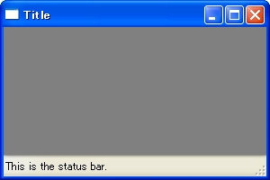
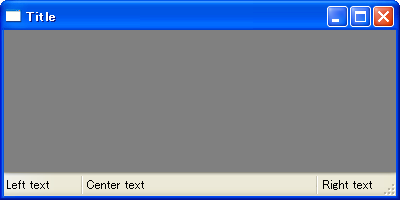

Frame にステータスバーを追加する
----

#### サンプルコード

~~~ python
import wx

class MyFrame(wx.Frame):
    def __init__(self):
        wx.Frame.__init__(self, None, -1, 'Title', size=(300,200))

        # Create status bar.
        self.CreateStatusBar()
        self.SetStatusText('This is the status bar.')

if __name__ == '__main__':
    app = wx.PySimpleApp()
    MyFrame().Show(True)
    app.MainLoop()
~~~

`wx.Frame` にステータスバーを表示したい場合は、`wx.Frame#CreateStatusBar()` を呼び出してから、`wx.Frame#SetStatusText(self, text, number=0)` によって表示内容を更新します。

ステータスバーに関するコードを分離して管理したい場合は、`wx.StatusBar` のサブクラスを作成します。
作成した `wx.StatusBar` インスタンスは、`wx.Frame#SetStatusBar()` で `wx.Frame` にセットすることができます。
この場合、`wx.StatusBar` 側のメソッド、`wx.StatusBar#SetStatusText(self, text, number=0)` を使って表示内容を更新することができます。

ステータスバーのテキストフィールドを分割する
----

#### サンプルコード

~~~ python
import wx

class MyFrame(wx.Frame):
    def __init__(self):
        wx.Frame.__init__(self, None, -1, 'Title', size=(400,200))

        # Create status bar.
        sb = self.CreateStatusBar()
        sb.SetFieldsCount(3)
        sb.SetStatusWidths([-1, -3, -1])
        sb.SetStatusText('Left text', 0)
        sb.SetStatusText('Center text', 1)
        sb.SetStatusText('Right text', 2)

if __name__ == '__main__':
    app = wx.PySimpleApp()
    MyFrame().Show(True)
    app.MainLoop()
~~~

`wx.StatusBar#SetFieldsCount()` メソッドで、ステータスバーのテキストフィールドを数を指定することができます。
ステータスバーを複数のテキストフィールドに分割した場合は、`wx.StatusBar.SetStatusText()` でテキストを設定するときにどの位置に設定するかを指定する必要があります（省略した場合は左端のテキストフィールドに設定されます）。

各テキストフィールドの幅は、`wx.StatusBar#SetStatusWidths()` メソッドで設定することができます。
サイズをピクセル数で指定する場合は正の数、相対的なサイズを指定する場合は負の数で指定します。
上記の例では、

~~~ python
sb.SetStatusWidths([-1, -3, -1])
~~~

と指定しているので、左、中央、右のテキストフィールドのサイズは 1:3:1 の比率で表示されます。
左と右のテキストフィールドのサイズのみを 100 ピクセルに固定したい場合は次のようにします。

~~~ python
sb.SetStatusWidths([100, -1, 100])
~~~

ステータスバーに設定したテキストの履歴を遡る
----

#### サンプルコード

~~~ python
import wx

class MyFrame(wx.Frame):
    def __init__(self):
        wx.Frame.__init__(self, None, -1, "Title", size=(300,200))

        # Create status bar.
        sb = self.CreateStatusBar()
        sb.PushStatusText('First')
        sb.PushStatusText('Second')
        sb.PushStatusText('Third')
        sb.PopStatusText()  # ==> 'Second'
        sb.PopStatusText()  # ==> 'First'

if __name__ == '__main__':
    app = wx.PySimpleApp()
    MyFrame().Show(True)
    app.MainLoop()
~~~

ステータスバーのテキストフィールドにテキストを設定するときに、`SetStatusText()` を使用する代わりに、`PushStatusText()` を使用しておくと、後から `PopStatusText()` を呼び出すことで 1 つ前に設定したテキストに戻すことができるようになります。

上記の例では、ステータスバーのテキストを `First`、`Second`、`Third` という順で設定し、`PopStatusText()` を 2 回実行しているので、結果として `First` と表示されます。

