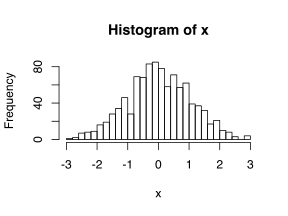
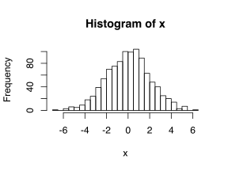

`rnorm()` を使用すると、指定した数のランダムな正規分布データを作成します。

```r
x <- rnorm(1000)
hist(x, breaks=30)
```

{: .center }

標準偏差 (standard deviation) はデフォルトで 1 となりますが、`sd` パラメータで任意の標準偏差を指定することもできます。

```r
x <- rnorm(1000, sd=2)
hist(x, breaks=30)
```

{: .center }

