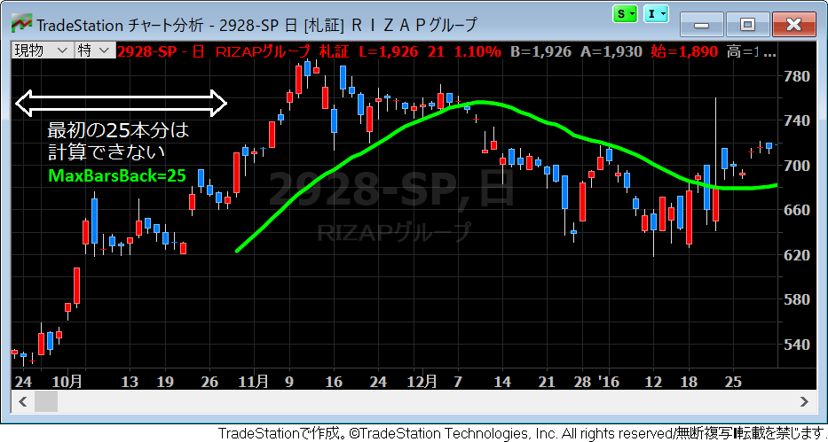

25 本移動平均線の MaxBarsBack の値
----

例えば、25本分の移動平均線を引くには、過去に25本分の情報が必要になるので、少なくともチャートの最初の24本は計算することができません。

{: .center}

上記のチャートは、25本の移動平均線のインジケーターを適用して、データの最初の部分を表示したものです。
最初の方のバーは計算ができないので、移動平均線が表示されていないことが分かります。

25本の移動平均線を引くためのインジケータのプログラムは、例えば下記のような感じで記述できます。
ラインを価格のチャートに重ねて表示するには、インジケーターのプロパティ設定で、スケール位置を「元データに軸を合わせる」に設定しておく必要があることに注意してください。

~~~
SetPlotColor(1, Green);  // 色: グリーン
SetPlotWidth(1, 3);      // 太さ: 3
Plot1(Average(Close, 25));
~~~

このようなインジケーターをチャートに適用すると、トレードステーションは内部で自動的に、過去何本分のバーが計算に必要かを計算し、**`MaxBarsBack`** というプロパティに格納します。
この例では、`MaxBarsBack` の値は 25 になります。

~~~
Print("MaxBarsBack=", MaxBarsBack:0:0);  // 25 と表示される
~~~

インジケーターの計算処理は、基本的にはバー１本ごとに実行されるのですが、`MaxBarsBack` が 25 であれば、最初の 24 本のバーでは計算することができないことが分かっています。
このような場合、トレードステーションは処理を最適化するために、24 本分のバーの計算をスキップするようになっています（25本目のバーからインジケーターの計算処理が行われます）。

現在処理中のバーの番号を取得するためのキーワードとして `CurrentBar` や `BarNumber` がありますが、この値が１になるのは、チャートの一番最初のバーではなく、`MaxBarsBack` の次のバーを示しています（計算処理が始まる最初のバーを示すということ）。

ちなみに、自動売買のためのストラテジを作成するときは、`MaxBarsBack` の値は明示的に固定の値を指定する必要があります（ストラテジーのプロパティダイアログから）。ストラテジの `MaxBarsBack` の値は、デフォルトで 50 になっています。

コラム: MaxBarsBack のわかりにくい振る舞い
----

`MaxBarsBack` が 25 であれば、過去 24 本分のバーがあれば 25 本目のバーの計算が行えるはずですが（公式の EasyLanguage Essential Programmers Guide にもそう記載されている）、実際の動作では、26 本目のバーから計算処理が開始され、そのバーが `BarNumber==1` となるようです。ちょっと気になりますが、まぁ、一本ずれたところで特に問題はないので、深追いはしないようにします(^^;)

あと、上記の例で `MaxBarsBack` は自動計算されて 25 と求められるのですが、インジケーターの最初の実行だけは、`MaxBarsBack==1` となるようです（なぜか `Once begin ～ end` のブロックが２回実行されるが、そのうちの１回目の処理は `MaxBarsBack==1` となる）。
試しに、下記のようなインジケータープログラムを実行すると、

~~~
Once begin
    Print("----");
    Print("CurrentBar=", CurrentBar:0:0, ", Date=", Date+19000000:8:0);
    Print("MaxBarsBack=", MaxBarsBack:0:0);
end;
~~~

次のように表示されます。

~~~
----
CurrentBar=1, Date=20150924
MaxBarsBack=1
----
CurrentBar=1, Date=20151029
MaxBarsBack=25
~~~

`Once` ブロックのはずなのに、なぜか２回実行されます。
どうやら、`MaxBarsBack` などの初期化処理のために、１番左側のバーでは少なくとも１回インジケーターの計算処理が実行されるようです（計算処理がスキップされない）。
そして、その処理によって `MaxBarsBack` の値が 25 であることが判明し、25本分のバーをスキップして、改めて `Once` ブロックから処理が再実行されるというメカニズムのようです。

